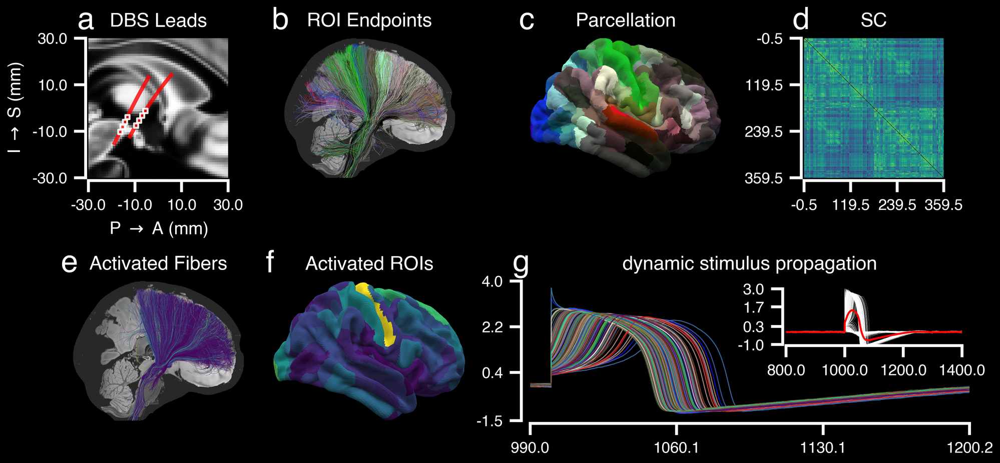
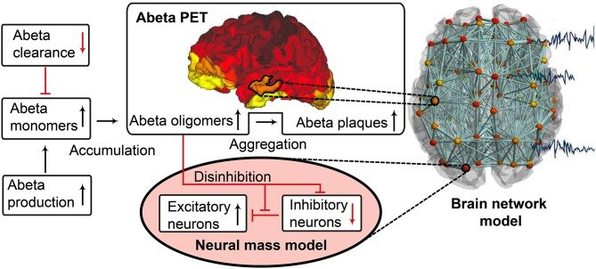
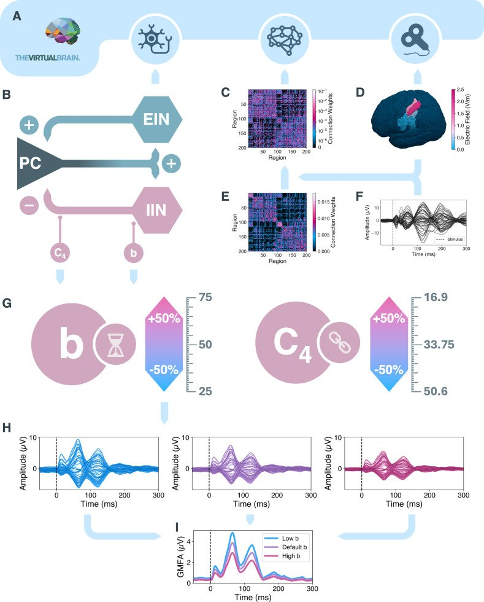

## The bottom line {.smaller}

::: {.bl-stats}
1 recipe · 11 diseases · 40 model applications
:::

::: {.bl-claim}
Brain disorders are disorders of **dynamics** — a personalized virtual brain makes them **measurable** and **treatable**.
:::

:::: {.fragment}
::: {.bl-proven}
**✓ Proven:** the **Virtual Epileptic Patient** is in **clinical trials** — no longer *whether* mechanistic models reach patients, but **where next**.
:::
::::

::::: {.fragment}
:::: {.bl-bets}
::: {.bet}

**Deep brain stimulation**

Target & settings *in silico* before surgery — Parkinson's · depression · OCD [@Meier2026]
:::
::: {.bet}

**Alzheimer's**

amyloid / tau → network failure → *digital twin* for early diagnosis
:::
::: {.bet}

**Mental disorders**

model the *mechanism* — E/I balance, synaptic gain — not a label
:::
::::
:::::

:::: {.fragment}
::: {.bl-payoff}
One model that **explains** the symptom · **predicts** the course · **rehearses** the treatment
:::
::::

::: {.notes}
