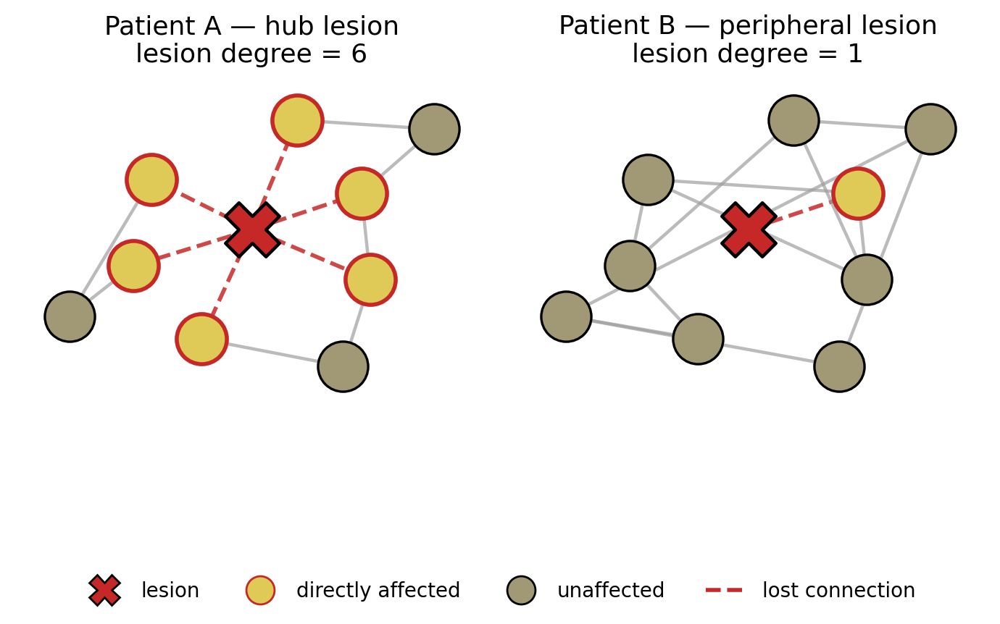
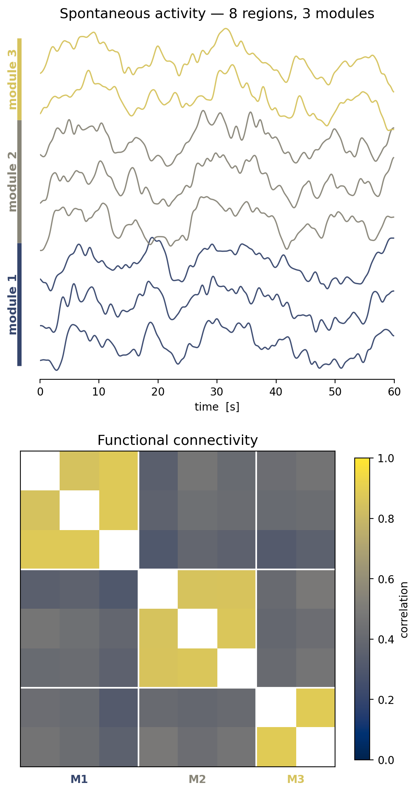
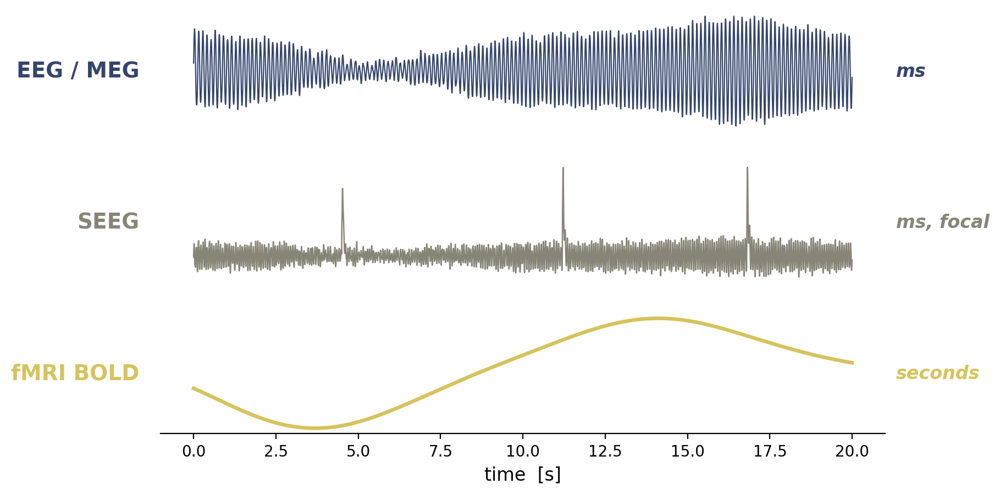
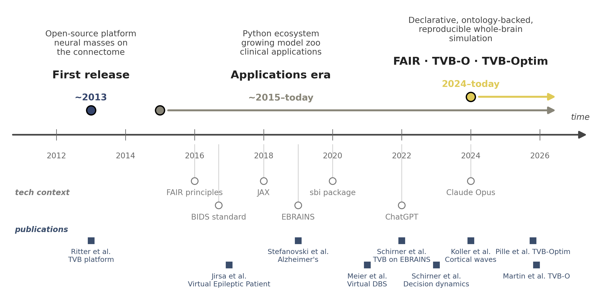

## Why network models? Same lesion, different outcomes

:::: {.columns}

::: {.column width="55%"}

::: {.incremental}
- Two patients, similar lesion location and volume
- Different deficits, different recovery trajectories
- The locus alone doesn't predict outcome
- Function lives in the **network**: regional damage propagates through the connections that survive
:::

:::

::: {.column width="45%"}

{fig-align="center"}

:::

::::
::: {.fragment}
**To predict outcome, model the whole network, not a catalogue of regions.**
:::

## Why dynamics? The brain is never idle

:::: {.columns}

::: {.column width="55%"}

::: {.incremental}
- At rest, the brain shows **structured spontaneous activity**, not noise
- Resting-state networks are reproducible across subjects and species
- Tasks are perturbations of this ongoing dynamical state
- Like a tennis player at the baseline: never still, poised for the next service
:::

::: {.fragment}
**A model has to reproduce the resting repertoire, not only stimulus responses.**
:::

:::

::: {.column width="45%"}

{fig-align="center" width="50%"}

:::

::::

## Outputs match what we measure

:::: {.columns}

::: {.column width="50%"}

::: {.incremental}
- TVB outputs **what scanners record:** EEG · MEG · SEEG · fMRI BOLD
- Each modality is a **forward model** ($h$) on the same simulated state
- Timescales come for free, EEG/SEEG in **ms**, BOLD in **seconds**
:::

::: {.fragment}
**Direct comparison with data, no translation gap.**
:::

:::

::: {.column width="50%"}

{fig-align="center"}

:::

::::

## A short history of TVB

{fig-align="center" width="100%"}

## From scans to a simulator: the TVB recipe

::: {.fragment}
::: {style="height:240px; background:rgba(104,128,175,0.08); border:2px dashed #6880af; border-radius:8px; display:flex; align-items:center; justify-content:center; padding:1em; text-align:center; color:#3a5080; font-size:0.8em; font-style:italic; margin-bottom:0.6em;"}
TODO: 4-tile recipe diagram — Connectome | Local dynamics | Coupling | Observation
:::
:::

::: {.smaller .fragment}

| Ingredient | Symbol | Source |
|---|---|---|
| **Connectome** (weights, delays) | $A_{ij},\ \tau_{ij}$ | DTI / tractography |
| **Local dynamics** | $f$ | Neural mass / mean-field model |
| **Coupling** | $g$ | Network propagation, with delays |
| **Observation** | $h$ | BOLD / EEG / MEG forward model |

:::

::: {.fragment .smaller}
The next slides unpack each building block.
:::

## Building Block 1: The Connectome

:::: {.columns}

::: {.column width="25%"}

:::

::: {.column width="25%" .fragment}

:::

::: {.column width="25%" .fragment}

:::

::: {.column width="25%" .fragment}

:::

::::

::: {.fragment .smaller}
**Diffusion MRI → tractography → parcellation → connectivity matrix.**
The output is the structural backbone $A_{ij}$ (weights) and $\tau_{ij}$ (delays).
:::

