# 4. Parameter exploration and inference {background-color="#6880af"}

## Models as computational hypotheses

A brain network model is a **hypothesis with knobs**.
Picking knob values is how we test the hypothesis against data.

::: {.fragment}
```{dot}
//| fig-align: center
//| fig-width: 5
//| fig-height: 1.6
digraph G {
    rankdir=LR;
    bgcolor="transparent";
    size="5,1.6!";
    ratio=compress;
    nodesep=0.25;
    ranksep=0.35;
    node [fontname="Helvetica", fontsize=14, fontcolor="black", style="filled,rounded", penwidth=2, margin="0.08,0.04"];
    edge [penwidth=1.2, arrowsize=0.7];

    theta [label="θ",         shape=ellipse, fillcolor="#e3f2fd", color="#1565c0"];
    sim   [label="brain network model", shape=box,     fillcolor="#fff3e0", color="#ef6c00"];
    yhat  [label="ŷ(θ)",      shape=ellipse, fillcolor="#f3e5f5", color="#6a1b9a"];
    yobs  [label="y",         shape=ellipse, fillcolor="#f3e5f5", color="#6a1b9a"];
    loss  [label="𝓛(θ)",         shape=hexagon, fillcolor="#ffebee", color="#c62828"];

    theta -> sim;
    sim   -> yhat;
    yhat  -> loss;
    yobs  -> loss;
}
```
:::

::: {.incremental}
- $\theta$: model parameters (the knobs)
- $\hat{y}(\theta)$: simulated observable (FC, power spectrum, BOLD …)
- $y_{\text{obs}}$: empirical observable / data
- $\mathcal{L}$: loss / discrepancy
:::


## What is inference for brain models?

:::: {.columns}
::: {.column width="60%"}
::: {.fragment}
**Inference:** which $\theta$ are consistent with the data?
:::
::: {.fragment}
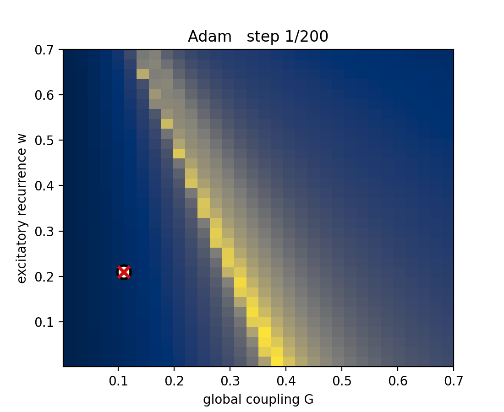{fig-align="center" width=75%}
:::
:::
::: {.column width="40%"}
::: {.fragment}
What do we need to do?
:::
::: {.incremental}
1. Define a loss function $\mathcal{L}(\theta)$
2. Test many $\theta$ configurations on $\mathcal{L}(\theta)$ to find the "best"
:::
:::
::::

## Why inference is hard for brain models?

::: {.incremental}
- **Expensive simulator**: seconds to minutes per run
- **High-dimensional**: when parameters become regional ($\times N$ nodes)
- **Non-smooth dynamics**: chaos, stochasticity, stiffness
- **Bumpy observables**: FC, FCD, PSD are summary statistics
- **Parameter degeneracy**: many parameter combinations fit about equally well
:::

::: {.fragment}
Every method is a **bet** about which of these difficulties dominates.
:::

## What makes inference for brain models easier?

::: {.incremental}
- **Faster simulator:** Parallelization and Accelerators (GPUs, TPUs, etc.)
- **Differentiability:** Gradient-based optimization 
- **Good Workflows:** Building complexity gradually
:::

::: {.fragment}
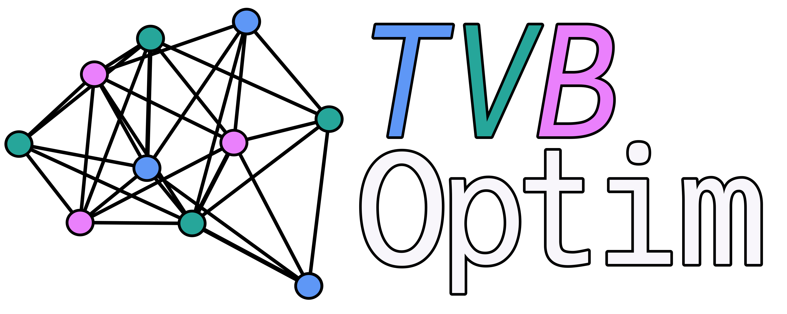{fig-align="center" width="50%"}
:::

## The example problem: fMRI functional connectivity

:::: {.columns}
::: {.column width="64%"}

::: {.fragment}
**Find global coupling $G$ and recurrence $w$ so simulated FC matches
empirical FC** in a Reduced Wong-Wang model on the Desikan-Killiany
parcellation.
:::

::: {.fragment}
Optimization over a parameter landscape:\
$\mathcal{L}(\theta) = \mathrm{RMSE}(\hat{FC}(\theta),\, FC_{\text{obs}})$.
:::

::: {.fragment}
- two knobs → still easy to picture
- note the **low-loss valley**: many $(w, G)$ pairs fit about
  equally well → a *degeneracy* typical of brain network models
:::
:::
::: {.column width="36%"}
::: {.fragment}
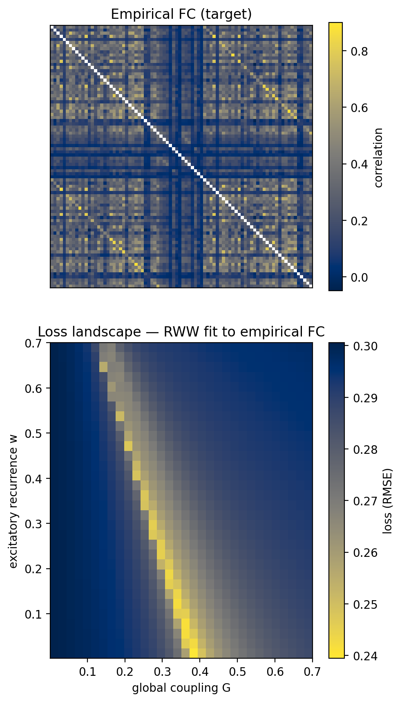{fig-align="center" fig-width="80%"}
:::
:::
::::

## Defining the running example in TVB-Optim

::: {.fragment}
TVB-Optim: A JAX based toolbox for whole-brain simulation and inference [@Pille2025]
:::

::: {.fragment}
```{.python code-line-numbers="1-7|9-10|12-18"}
# 1. Compose the brain network model from graph, dynamics, coupling, noise
graph    = DenseGraph(weights, region_labels=region_labels)
dynamics = ReducedWongWang(w=0.5, I_o=0.32, INITIAL_STATE=(0.3,))
coupling = FastLinearCoupling(local_states=["S"], G=0.5)
noise    = AdditiveNoise(sigma=0.00283, apply_to="S")
network  = Network(dynamics=dynamics, coupling={"instant": coupling},
                   graph=graph, noise=noise)

# 2. prepare() splits what to compute (`model`, pure & jittable) from what to plug in (`state`)
model, state = prepare(network, Heun(), t1=120_000, dt=4.0)

# 3. Observation + loss are plain Python functions of `state`
# Every algorithm in this section calls the same loss(s); only how `state` is varied changes
def observation(state):
    return compute_fc(bold_monitor(model(state)), skip_t=20)

def loss(state):
    return rmse(observation(state), fc_target)
```
:::

## Parallelism: `jax.vmap` and `jax.pmap` under the hood

::: {.fragment}
```{.python code-line-numbers="1|2-3|4"}
# Explore a 10x10 = 100 grid over (theta_1, theta_2)
state.coupling.theta_1 = GridAxis(-1.0, 1.0, 10)
state.dynamics.theta_2 = GridAxis(-1.0, 1.0, 10)
losses = ParallelExecution(loss, Space(state, mode="product"), n_pmap=8).run()
```
:::
::: {.fragment}
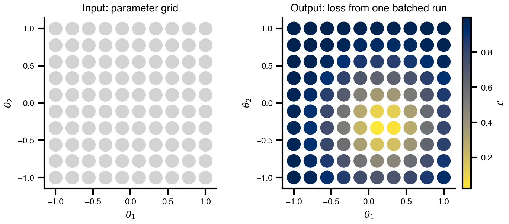{fig-align="center" width="50%"}
:::
::: {.fragment style="margin-top:-1.2em"}
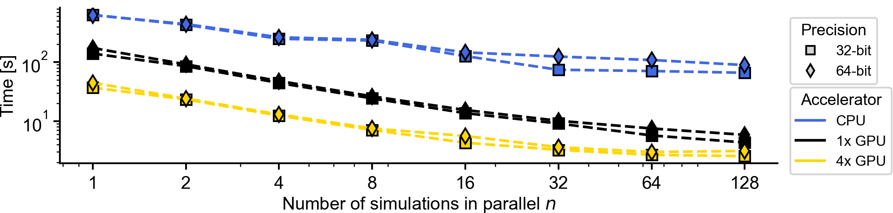{fig-align="center" width="70%" style="margin:0"}
:::


## Grid search: map the whole landscape

:::: {.columns}
::: {.column width="55%"}
::: {.incremental}
- Same idea as the bifurcation diagrams from §3
- Wins when: $\le 2$–$3$ parameters, you want to *see* the landscape
- Cost grows as $N^d$ — unusable beyond a handful of dimensions
:::

::: {.fragment}
```python
# Explore a 32x32 grid space of w and G
grid_state.dynamics.w = GridAxis(0.001, 0.7, 32)
grid_state.coupling.G = GridAxis(0.001, 0.7, 32)
grid = Space(grid_state, mode="product")
losses = ParallelExecution(loss, grid, n_pmap=8).run()
```
:::
:::
::: {.column width="45%"}
::: {.fragment}
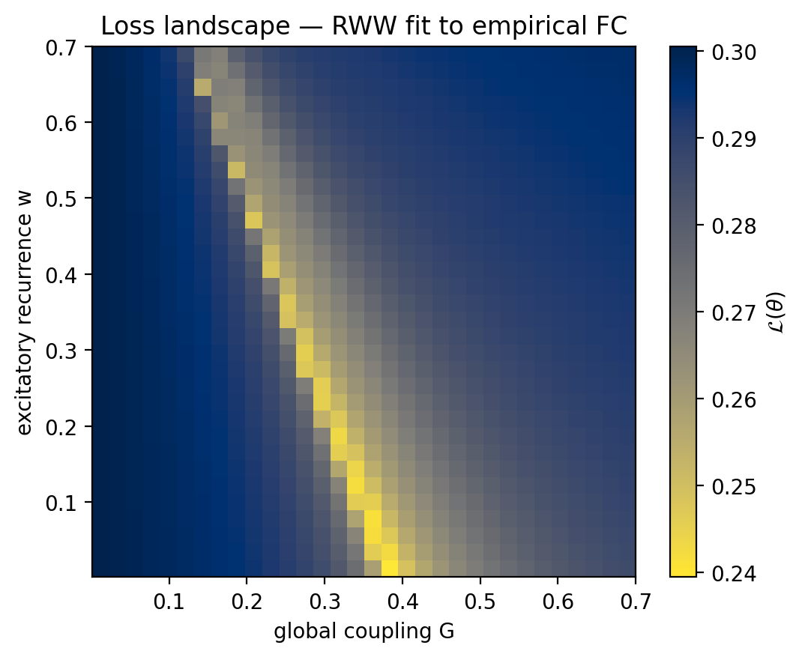{fig-align="center"}
:::
:::
::::

## Random search: the surprising upgrade

::: {.r-stack style="align-items: flex-start; justify-content: center;"}
::: {.fragment .fade-out fragment-index=5}
:::: {.columns}
::: {.column width="40%"}
::: {.fragment fragment-index=1}
In more than 2–3 dimensions, **random search beats grid** for the same budget.
:::

::: {.fragment fragment-index=3}
**Why?** Real loss surfaces have **low effective dimensionality**, most
parameters barely matter. Grid spends its budget evenly across all axes;
random samples *every axis at every trial* [@bergstra2012].
:::
:::
::: {.column width="60%"}
::: {.fragment fragment-index=2}
![Grid vs. Random search, taken from [@bergstra2012] figure 1](img/section-4/grid_vs_random_bergstra.png){fig-align="center"}
:::
::: {.fragment fragment-index=4}
```{.python code-line-numbers="2-3|"}
# Explore a 100 samples space of w and G
random_state.dynamics.w = UniformAxis(0.001, 0.7, 100)
random_state.coupling.G = UniformAxis(0.001, 0.7, 100)
samples = Space(random_state, mode="zip", key=jax.random.key(42))
losses = ParallelExecution(loss, samples, n_pmap=8).run()
```
:::
:::
::::
:::

::: {.fragment fragment-index=5}
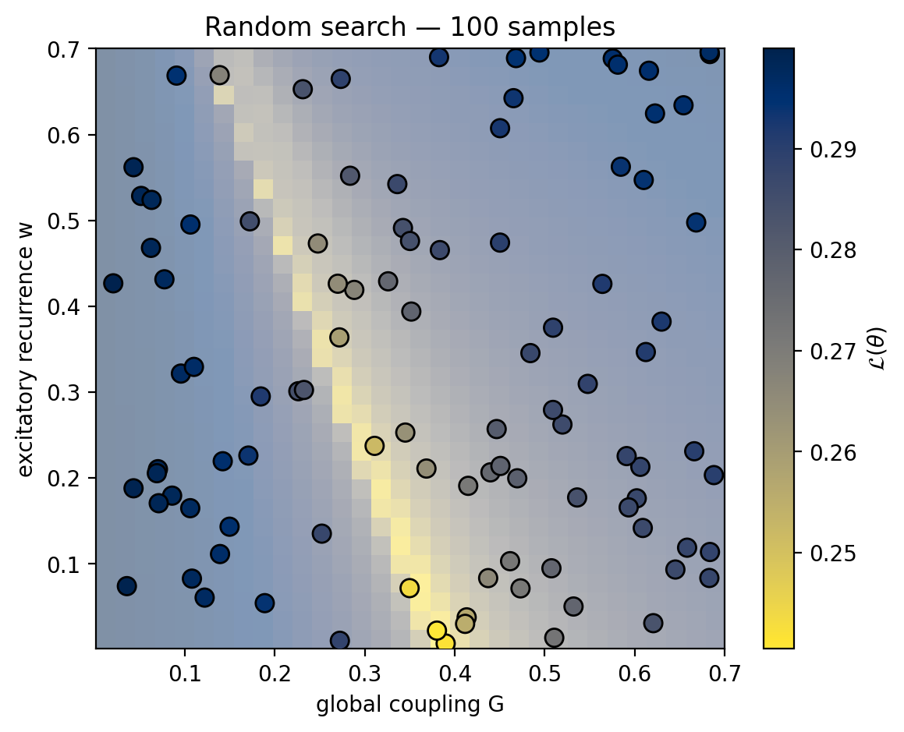{fig-align="center" width="65%"}
:::
:::
## Quasi-random Sobol: Sensitivity for free

:::: {.columns}
::: {.column width="60%"}
::: {.incremental}
- **Sobol** / **Latin Hypercube** sequences: low-discrepancy, drop-in
  replacement for the uniform sampler
- Same design powers **variance-based sensitivity analysis:**
  Saltelli + Sobol indices quantify *which knobs the loss actually depends on*
:::

::: {.fragment}
```{.python code-line-numbers="|1-4|6-9|10"}
problem = {"num_vars": 3,
           "names":  ["G", "w", "sigma"],
           "bounds": [[0.001, 0.7], [0.001, 0.7], [0.001, 0.01]]}
samples = sobol_sample.sample(problem, 256)   # Saltelli design

state.coupling.G  = DataAxis(samples[:, 0])
state.dynamics.w  = DataAxis(samples[:, 1])
state.noise.sigma = DataAxis(samples[:, 2])
losses = ParallelExecution(loss, Space(state, mode="zip")).run()
Si = sobol_analyze.analyze(problem, np.array(losses))
```
:::
:::
::: {.column width="40%"}
::: {.fragment}
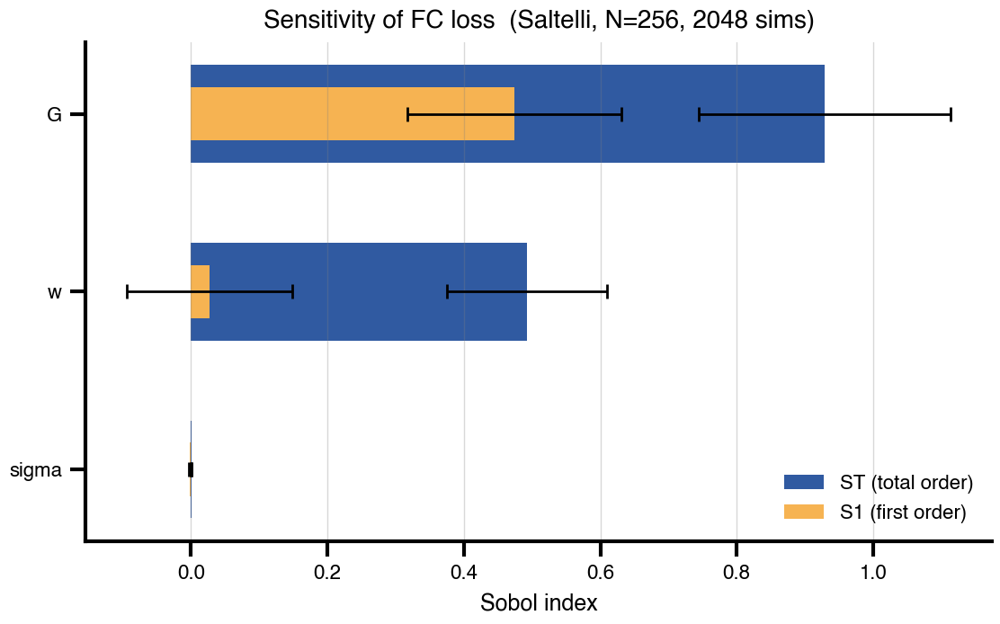{fig-align="center" width="120%"}
:::
::: {.incremental style="margin-bottom:-0.6em"}
* $S_T(\sigma) \approx 0$
* $S_T(G) \approx 0.93$
* $S_T(w) \approx 0.49$
- $S_2(G\times w) = 0.46$
:::
::: {.fragment style="margin-top:-0.4em"}
**Take-away:**
the FC loss lives on an effective **2D subspace**.
:::
:::
::::

## Evolutionary Approaches: adaptive, no gradients

:::: {.columns}
::: {.column width="60%"}
::: {.incremental}
- Maintain a **population**, update a **mean** and **covariance** to bias
  future samples
- Naturally parallel: every generation is one `DataAxis` evaluation
- **No gradients needed** → works on noisy / discontinuous losses
- Wins when: ~10–50 parameters
:::

::: {.fragment}
```{.python code-line-numbers="|1-4|5-8|9"}
es = cma.CMAEvolutionStrategy([0.05, 0.6], 0.15,
  {"popsize": 16})
while not es.stop():
    pop = np.array(es.ask())
    s.coupling.G = DataAxis(pop[:, 0])
    s.dynamics.w = DataAxis(pop[:, 1])
    losses = ParallelExecution(
        loss, Space(s, mode="zip")).run()
    es.tell(pop.tolist(), np.array(losses).tolist())
```
:::
:::
::: {.column width="40%"}
::: {.fragment}
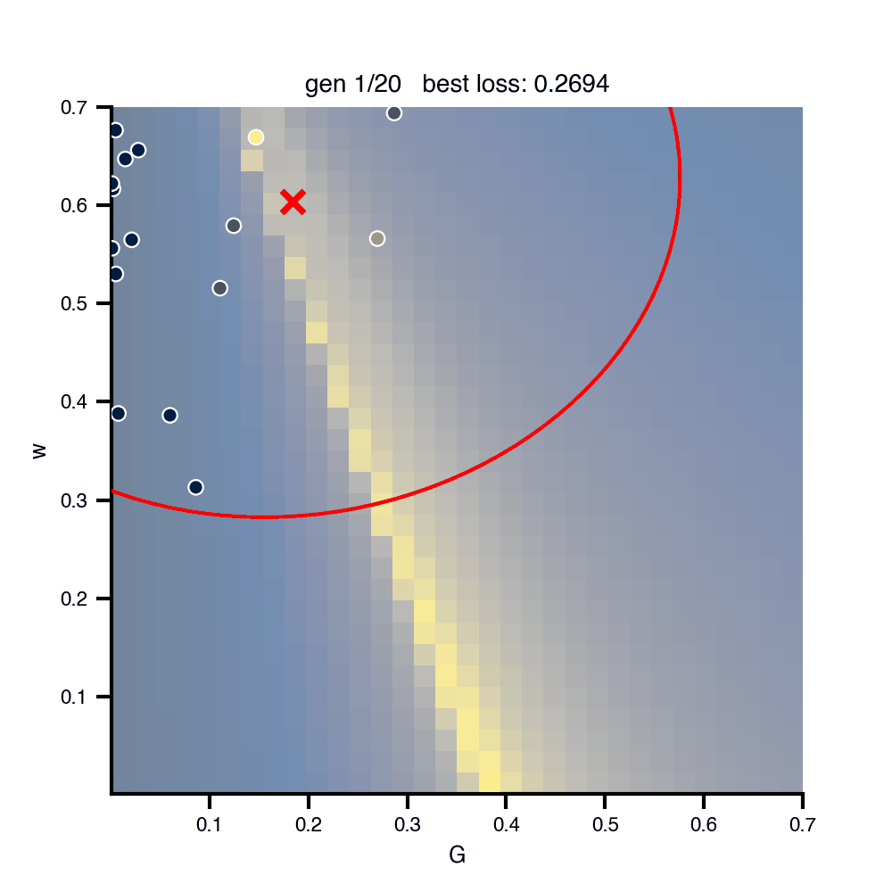{fig-align="center"}
:::
:::
::::

## Hitting the wall: why sampling stops scaling

Everything so far - grid, random / Sobol, Genetic algorithms - **searches by sampling** the simulator.

::: {.fragment}
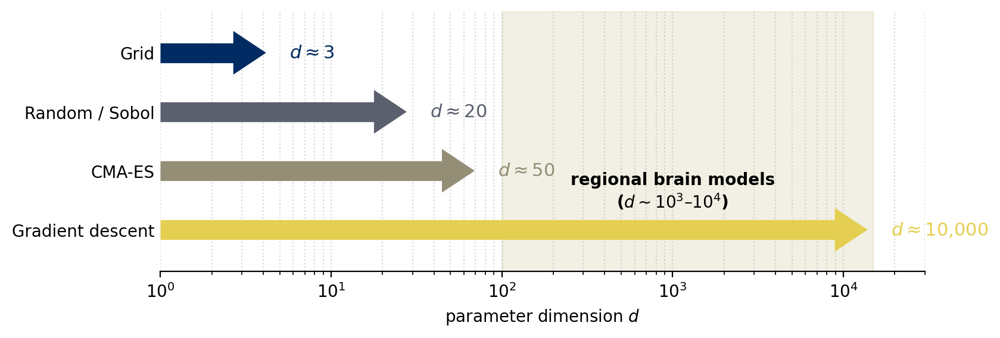{fig-align="center" width="80%"}
:::

::: {.fragment}
But a brain network model with **regional** parameters has $d \sim 10^2$–$10^4$ knobs
(e.g. one $w_i$ per Desikan-Killiany region, plus per-region noise, plus …).
No sampling budget reaches that regime.
:::

## Automatic differentiation: Gradients (almost) for free

**Run forward once, run backward once.** Reverse-mode AD sweeps the
computation graph in reverse, accumulating $\partial\mathcal{L}/\partial\theta_i$ for *every* $i$ at the same time → $\text{cost}(\nabla_\theta \mathcal{L}) \approx 3\text{–}30 \times \text{cost}(\mathcal{L})$.

::: {.fragment}
:::: {.columns}
::: {.column width="65%"}
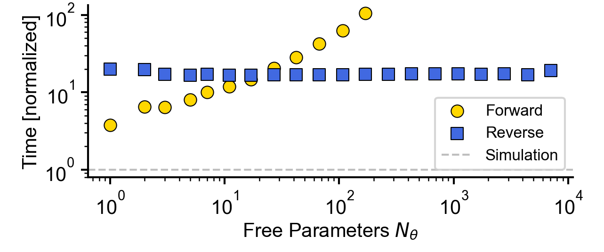{fig-align="center"}
:::
::: {.column width="35%"}
[*Gradient cost in tvboptim, normalized by one simulation. Reverse-mode (blue) is flat at $\sim 20\times$ across $d \in [1, 10^4]$, independent of dimension.*]{style="font-size:0.7em; display:block; margin-top:30%;"}
:::
::::
:::

::: {.fragment style="margin-top:-2em"}
In JAX: `jax.grad(loss)`. One line, gradients with respect to every
knob — what made per-region fits tractable.
:::

## Gradient descent: The regime-changer

:::: {.columns}
::: {.column width="60%"}

::: {.fragment}
$$
\theta_{t+1} \;=\; \theta_t - \eta \,\nabla_\theta\, \mathcal{L}(\theta_t)
$$
:::

::: {.incremental}
- The cheapest way to scale to **regional / per-node** parameter vectors
  (hundreds–thousands of knobs)
- Local: needs a reasonable starting point
- Point estimate: Only finds a single good fit 
:::

::: {.fragment}
```{.python code-line-numbers="1-2|3|4"}
state.dynamics.w = Parameter(state.dynamics.w)
state.coupling.G = Parameter(state.coupling.G)
opt = OptaxOptimizer(loss, optax.adam(0.01))
fitted, _ = opt.run(state, max_steps=200)
```
:::
:::
::: {.column width="40%"}
::: {.fragment}
{fig-align="center"}
:::
:::
::::

## Bayesian inference — when you want a posterior

A point estimate $\theta^\star$ tells you *one* good fit.
A posterior tells you **all fits consistent with the data**.

::: {.fragment}
$$
\underbrace{p(\theta \mid y)}_{\text{posterior}}
\;\propto\;
\underbrace{p(y \mid \theta)}_{\text{likelihood}}
\;\cdot\;
\underbrace{p(\theta)}_{\text{prior}}
$$

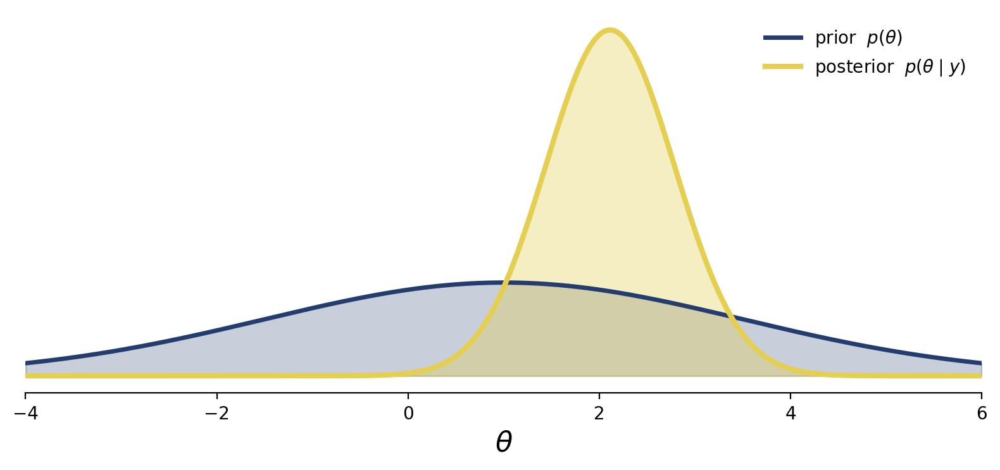{fig-align="center" width="70%"}
:::

## Priors encode what you (already) know

A prior $p(\theta)$ is a probabilistic statement about parameters
**before** you see this dataset. Three regimes:

::: {.incremental}
- {height="1.4em" style="vertical-align:middle"} **Flat / uninformative:** `Uniform` over a physiological range.
  *"I know the bounds, nothing else."* Posterior is dominated by data.
- 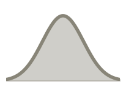{height="1.4em" style="vertical-align:middle"} **Weakly informative:** `Normal` around a literature value with
  generous spread. Regularizes, prevents pathological fits.
- 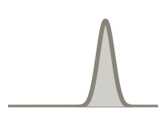{height="1.4em" style="vertical-align:middle"} **Strongly informative:** derived from independent measurements:
  anatomy, tau / amyloid PET maps, receptor density, EEG power.
  *"This patient's region has elevated tau"* → prior on local
  excitation **per region**.
:::

::: {.fragment}
**Same simulator, same data, different priors → different posteriors.**
The prior is where domain knowledge enters the inference, *cleanly* and
*auditably*.
:::

## HMC vs SVI: same model, two budgets {.smaller}

::: {.fragment}
Same `model`, same wide priors ($G, w \sim \mathcal{U}(0.001, 0.7)$).
Different inference algorithm.
:::

::: {.fragment}
:::: {.columns}
::: {.column width="60%"}
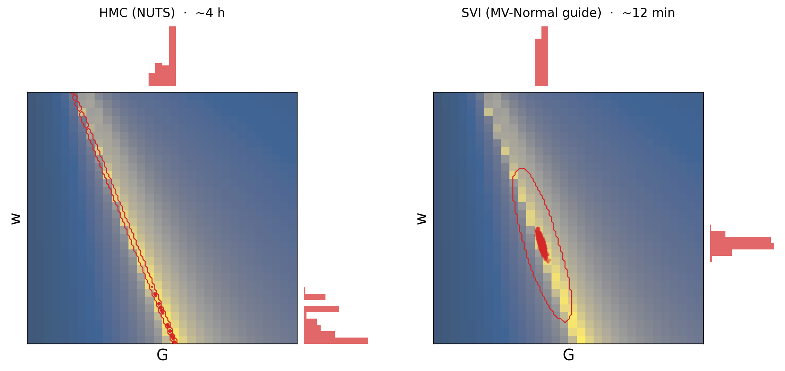{fig-align="center"}
:::
::: {.column width="40%"}
[*HMC (left) and SVI (right) on the same `model`. Background: grid-scan loss landscape. Red points: posterior samples; red contours: KDE; histograms: marginals. HMC bends along the valley; the SVI Gaussian aligns with it locally but cannot curve.*]{style="font-size:0.7em; display:block; margin-top:30%;"}
:::
::::
:::

::: {.fragment style="margin-top:-1.5em"}
:::: {.columns}
::: {.column width="50%" .smaller}
**HMC / NUTS — gold standard.**

- Asymptotically exact samples; recovers the curved ridge
- **~4 h** for 300 samples · simulator-bound
:::
::: {.column width="50%" .smaller}
**SVI — fast approximation.**

- Fits a Gaussian guide $q_\phi(G, w)$ by gradient descent on the ELBO
- Captures *local* direction of the valley, not its curvature
- **~12 min** — 20× faster
:::
::::
:::

## When gradients break: simulation-based inference

When the simulator is chaotic or a black box, sample anyway.

::: {.fragment}
```{dot}
//| fig-align: center
//| fig-width: 9
//| fig-height: 2.2
digraph SBI {
    rankdir=LR;
    bgcolor="transparent";
    nodesep=0.35;
    ranksep=0.55;
    node [fontname="Helvetica", fontsize=14, style="filled,rounded",
          penwidth=2, margin="0.12,0.08"];
    edge [penwidth=1.4, arrowsize=0.8];

    prior [label="prior\np(θ)",            shape=ellipse, fillcolor="#e3f2fd", color="#1565c0"];
    sim   [label="simulator\n(black box)", shape=box,     fillcolor="#fff3e0", color="#ef6c00"];
    pairs [label="(θᵢ, yᵢ)\nsamples",      shape=note,    fillcolor="#f1f8e9", color="#558b2f"];
    nde   [label="neural density\nestimator",       shape=box,     fillcolor="#ede7f6", color="#4527a0"];
    post  [label="p(θ | y)",               shape=ellipse, fillcolor="#f3e5f5", color="#6a1b9a"];

    prior -> sim   [label=" draw θ"];
    sim   -> pairs [label=" run"];
    pairs -> nde   [label=" train"];
    nde   -> post  [label=" query y"];
}
```
:::

::: {.fragment}
**Amortized**: pay the simulation budget once, query any new $y$ in milliseconds.
:::

::: {.fragment}
Gradients available → HMC / SVI. Gradients break → SBI.
:::

## Choosing a method: Cheat Sheet

::: {.r-fit-text}
| **method**       | **scales to**                      | **cost (forward sims)**            | **what you get**                |
|--------------|-----------------------------------|------------------------------------|---------------------------------|
| Grid             | $\le 3$ params                     | $N^d$                              | full landscape                  |
| Random / Sobol   | $\sim 20$                          | $10^2$–$10^3$                      | landscape sketch                |
| CMA-ES / GA      | $\sim 50$                          | $10^3$–$10^4$                      | local optimum                   |
| Gradient descent | $10^4$+ (regional)                 | $10^3$–$10^5$                      | local optimum                   |
| SVI              | $10^4$+                            | $10^4$–$10^6$                      | approximate posterior           |
| HMC / NUTS       | $10^4$+, simulator-bound          | $10^5$–???                      | (asymptotically-)exact posterior          |
| SBI (NPE / NLE)  | $\sim 10^2$, simulator-bound       | $10^4$–$10^6$ upfront, **amortized** | amortized approximate posterior |
:::

::: {.fragment}
Cost numbers assume reverse-mode AD makes a gradient step ≈ one forward sim.
*Bayesian rows sit at the expensive end*, a posterior is worth roughly a thousand point estimates' worth of compute.
:::

## Chaos eats your gradient

:::: {.columns}
::: {.column width="45%"}
::: {.fragment}
Not a bug in automatic differentiation, the dynamics are telling you the loss is non-smooth
at fine scales.
:::

::: {.fragment}
**Mitigations**

- integrate over shorter windows
- *smooth* observables
- multiple shooting
- gradient clipping
:::
:::
::: {.column width="55%"}
::: {.fragment}
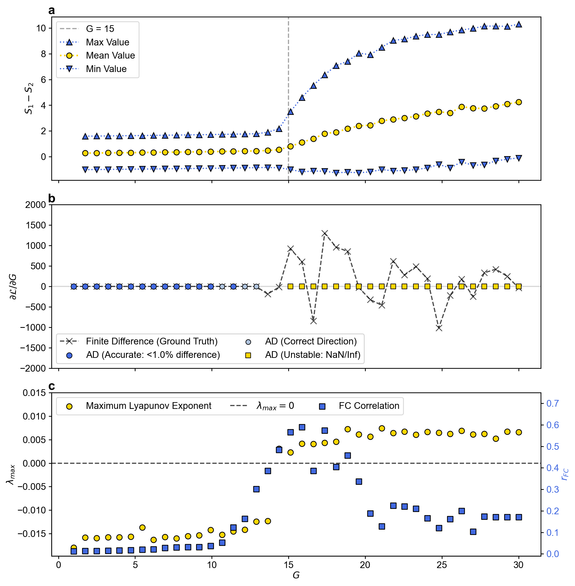{fig-align="center"}
:::
:::
::::


## The TVB-Optim workflow

1. **Bifurcation map** (§3) → pick a *regime* of interest
2. **Coarse random / Sobol search** within that regime → find a basin
3. **Gradient descent** from the basin → polish to a local optimum
4. **Optional: Bayesian inference** (HMC, SVI, or SBI when gradients break) from the optimum → posterior + uncertainty

::: {.fragment style="margin-top:-1.5em"}
→ each step uses the output of the previous as a **warm start**.
:::

::: {.fragment}
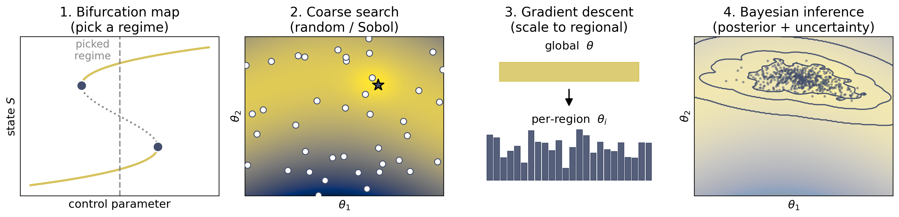{fig-align="center" width="105%"}
:::

## Use-cases

**I — fMRI Bold FC Optimization**

- Same as toy model, extent to regional w
- Link:  

**II — MEG Peak Frequency Optimization**

- Fit the Peak frequencies of an oscillating model to match empirical data
- Link:

