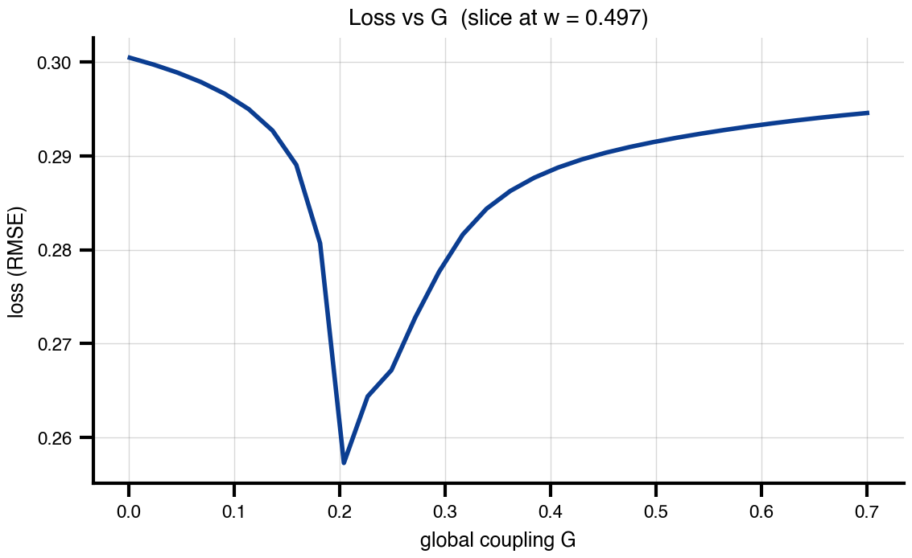

# 4. Parameter exploration and inference {background-color="#0b3d91"}

## Models as computational hypotheses

A brain network model is a **hypothesis with knobs**.
Picking knob values is how we test the hypothesis against data.

::: {.fragment}
$$
\theta \;\longrightarrow\; \text{simulator} \;\longrightarrow\; \hat{y}(\theta) \;\longrightarrow\; \mathcal{L}\big(\hat{y}(\theta),\, y_{\text{obs}}\big)
$$

- $\theta$: model parameters (the knobs)
- $\hat{y}(\theta)$: simulated observable (FC, power spectrum, BOLD …)
- $y_{\text{obs}}$: empirical observable
- $\mathcal{L}$: loss / discrepancy
:::

::: {.fragment}
*Inference $:=$ which $\theta$ are consistent with the data?*
:::

## Why inference is hard for brain models

::: {.incremental}
- **Expensive simulator**: seconds to minutes per run
- **High-dimensional**: when parameters become regional ($\times N$ nodes)
- **Non-smooth dynamics**: chaos, stochasticity, stiffness
- **Bumpy observables**: FC, FCD, PSD are summary statistics
:::

::: {.fragment}
Every method is a **bet** about which of these difficulties dominates.
:::

## The shape of the problem

:::: {.columns}
::: {.column width="64%"}

::: {.fragment}
Running example for this block:
**fit global coupling $G$ and recurrence $w$ so simulated FC matches
empirical FC** in a Reduced Wong-Wang model on the Desikan-Killiany
parcellation.
:::

::: {.fragment}
Optimization over a parameter landscape $\mathcal{L}(\theta) = \mathrm{RMSE}(\hat{FC}(\theta),\, FC_{\text{obs}})$.
:::

::: {.fragment}
- two knobs → still easy to picture
- note the **low-loss valley**: many $(w, G)$ pairs fit about
  equally well → a *degeneracy* typical of brain network models
:::
:::
::: {.column width="36%"}
::: {.fragment}
{fig-align="center" fig-width="80%"}
:::
:::
::::

## Defining the running example in TVB-Optim

::: {.fragment}
TVB-Optim: A JAX based toolbox for whole-brain simulation and inference [@Pille2025]
:::

::: {.fragment}
```{.python code-line-numbers="1-7|9-10|12-18"}
# 1. Compose the brain network model from graph, dynamics, coupling, noise
graph    = DenseGraph(weights, region_labels=region_labels)
dynamics = ReducedWongWang(w=0.5, I_o=0.32, INITIAL_STATE=(0.3,))
coupling = FastLinearCoupling(local_states=["S"], G=0.5)
noise    = AdditiveNoise(sigma=0.00283, apply_to="S")
network  = Network(dynamics=dynamics, coupling={"instant": coupling},
                   graph=graph, noise=noise)

# 2. prepare() splits what to compute (`model`, pure & jittable) from what to plug in (`state`)
model, state = prepare(network, Heun(), t1=120_000, dt=4.0)

# 3. Observation + loss are plain Python functions of `state`
# Every algorithm in this section calls the same loss(s); only how `state` is varied changes
def observation(state):
    return compute_fc(bold_monitor(model(state)), skip_t=20)

def loss(state):
    return rmse(observation(state), fc_target)
```
:::

## Parallelism — `vmap` and `pmap` under the hood

::: {.incremental}
- `Space(state, mode="product" | "zip")` with `Axes`declares which parameters vary together
- `ParallelExecution(loss, space, n_pmap=8, n_vmap=8)` `vmap`s across the batch axis and `pmap`s across devices
- One simulator, batched over parameter sets, fused into a single XLA pass — **no manual batching**
:::

::: {.fragment}
```python
# Explore a 32x32 = 1024 grid space of w and G
state.coupling.G = GridAxis(0.001, 0.7, 32)
state.dynamics.w = GridAxis(0.001, 0.7, 32)
losses = ParallelExecution(loss, Space(state, mode="product"), n_pmap=8).run()
```
:::

::: {.fragment}
Random search, Sobol designs, and CMA-ES populations all become **one batched forward pass**. A "1024-point sweep" is roughly *one* simulation's wall time on a GPU.
:::

## Grid search — map the whole landscape

:::: {.columns}
::: {.column width="55%"}
- Same idea as the bifurcation diagrams from §3
- Wins when: $\le 2$–$3$ parameters, you want to *see* the landscape
- Cost grows as $N^d$ — unusable beyond a handful of dimensions

```python
# Explore a 32x32 grid space of w and G
grid_state.dynamics.w = GridAxis(0.001, 0.7, 32)
grid_state.coupling.G = GridAxis(0.001, 0.7, 32)
grid = Space(grid_state, mode="product")
losses = ParallelExecution(loss, grid, n_pmap=8).run()
```
:::
::: {.column width="45%"}
{fig-align="center"}
:::
::::

## Random search — the surprising upgrade

:::: {.columns}
::: {.column width="50%"}
In more than 2–3 dimensions, **random search beats grid** for the same budget.

::: {.fragment}
**Why?** Real loss surfaces have **low effective dimensionality** — most
parameters barely matter. Grid spends its budget evenly across all axes;
random samples *every axis at every trial* [@bergstra2012].
:::

::: {.fragment}
**Take-away.** If you don't know which parameters matter, *don't grid*.
:::
:::
::: {.column width="50%"}
![Grid vs. Random search, taken from [@bergstra2012] figure 1](img/section-4/grid_vs_random_bergstra.png){fig-align="center"}

```python
# Explore a 100 samples space of w and G
grid_state.dynamics.w = UniformAxis(0.001, 0.7, 100)
grid_state.coupling.G = UniformAxis(0.001, 0.7, 100)
grid = Space(grid_state, mode="zip", key=jax.random.key(42))
losses = ParallelExecution(loss, grid, n_pmap=8).run()
```

{fig-align="center" .fragment}
:::
::::

## Quasi-random Sobol — sensitivity for free

:::: {.columns}
::: {.column width="55%"}
::: {.incremental}
- **Sobol** / **Latin Hypercube** sequences: low-discrepancy, drop-in
  replacement for the uniform sampler
- Same design powers **variance-based sensitivity analysis** —
  Saltelli + Sobol indices quantify *which knobs the loss actually depends on*
:::

::: {.fragment}
```{.python code-line-numbers="|1-4|6-9|10"}
problem = {"num_vars": 3,
           "names":  ["G", "w", "sigma"],
           "bounds": [[0.001, 0.7], [0.001, 0.7], [0.001, 0.01]]}
samples = sobol_sample.sample(problem, 256)   # Saltelli design

state.coupling.G  = DataAxis(samples[:, 0])
state.dynamics.w  = DataAxis(samples[:, 1])
state.noise.sigma = DataAxis(samples[:, 2])
losses = ParallelExecution(loss, Space(state, mode="zip")).run()
Si = sobol_analyze.analyze(problem, np.array(losses))
```
:::
:::
::: {.column width="45%"}
::: {.fragment}
{fig-align="center"}
:::
::: {.fragment}
$S_T(\sigma) \approx 0$, $S_T(G) \approx 0.93$, $S_T(w) \approx 0.49$ —
the FC loss lives on an effective **2D subspace**.
:::
:::
::::

## Reading Sobol indices honestly

:::: {.columns}
::: {.column width="55%"}
| param | $S_1$ | $S_T$ |
|------|------:|------:|
| **G** | 0.47 | 0.93 |
| **w** | 0.03 | 0.49 |
| sigma | ≈ 0  | ≈ 0  |

::: {.incremental}
- $S_1$: parameter **alone** · $S_T$: alone + all interactions
- $S_T \gg S_1$ for $w$ → $w$ matters **only with $G$**
- $S_2(G\times w) = 0.46$ → the curved valley **is** that interaction
:::

::: {.fragment}
**Take-away:** Drop $\sigma$; fit $(G, w)$ **jointly**
:::
:::
::: {.column width="45%"}
{fig-align="center"}

:::
::::

## Evolutionary / CMA-ES — adaptive, no gradients

:::: {.columns}
::: {.column width="60%"}
::: {.incremental}
- Maintain a **population**, update a **mean** and **covariance** to bias
  future samples
- Naturally parallel — every generation is one `DataAxis` evaluation
- **No gradients needed** → works on noisy / discontinuous losses
- Wins when: ~10–50 parameters
:::

::: {.fragment}
```python
es = cma.CMAEvolutionStrategy([0.05, 0.6], 0.15,
  {"popsize": 16})
while not es.stop():
    pop = np.array(es.ask())
    s = copy.deepcopy(state)
    s.coupling.G = DataAxis(pop[:, 0])
    s.dynamics.w = DataAxis(pop[:, 1])
    fits = ParallelExecution(
        loss, Space(s, mode="zip")).run()
    es.tell(pop.tolist(), np.array(fits).tolist())
```
:::
:::
::: {.column width="40%"}
{fig-align="center"}
:::
::::

## Hitting the wall — why sampling stops scaling

Everything so far — grid, random / Sobol, CMA-ES — **searches by sampling** the simulator.

::: {.incremental}
- **Grid:** $N^d$ points → tops out at 2–3 parameters
- **Random / Sobol:** $10^2$–$10^3$ samples → effective up to $\sim 20$
- **CMA-ES:** $10^3$–$10^4$ sims → effective up to $\sim 50$
:::

::: {.fragment}
But a brain network model with **regional** parameters has $d \sim 10^3$–$10^4$ knobs
(e.g. one $w_i$ per Desikan-Killiany region, plus per-region noise, plus …).
No sampling budget reaches that regime.
:::

::: {.fragment}
**Gradient descent** does — *if* we can compute $\nabla_\theta \mathcal{L}$ cheaply.
:::

## Finite differences and forward-mode AD

**Finite differences.** Wiggle each knob, re-simulate, measure the change.

$$
\frac{\partial \mathcal{L}}{\partial \theta_i} \approx \frac{\mathcal{L}(\theta + \varepsilon e_i) - \mathcal{L}(\theta)}{\varepsilon}
\qquad\Rightarrow\qquad d \text{ sims per gradient step}
$$

::: {.fragment}
**Forward-mode AD.** Same idea, made exact: propagate one tangent direction per pass. Cost **still grows linearly with $d$** — just without the truncation error.
:::

::: {.fragment}
1 000 knobs ⇒ 1 000 × simulation cost **per step**. Dead on arrival at regional scale.
:::

## Reverse-mode AD — gradients (almost) for free

:::: {.columns}
::: {.column width="45%"}
**Run forward once, run backward once.** The backward pass sweeps the computation graph in reverse, accumulating $\partial\mathcal{L}/\partial\theta_i$ for *every* $i$ at the same time.

$$
\text{cost}\!\left(\nabla_\theta \mathcal{L}\right) \approx 3\text{–}30 \times \text{cost}(\mathcal{L})
$$

::: {.fragment}
In JAX: `jax.grad(loss)`. This is what made per-region fits tractable.
:::
:::
::: {.column width="55%"}
![Gradient cost in tvboptim, normalized by one simulation. Reverse-mode (blue) is flat at $\sim 20\times$ across $d \in [1, 10^4]$. Forward-mode (yellow) scales linearly with $d$ — same trap as finite differences.](img/section-4/ad_perf.png){fig-align="center"}
:::
::::

## Gradient descent — the regime-changer

:::: {.columns}
::: {.column width="60%"}

::: {.fragment}
$$
\theta_{t+1} \;=\; \theta_t - \eta \,\nabla_\theta\, \mathcal{L}(\theta_t)
$$
:::

::: {.incremental}
- The only method that scales to **regional / per-node** parameter vectors
  (hundreds–thousands of knobs)
- Local: needs a reasonable starting point
:::

::: {.fragment}
```python
state.dynamics.w = Parameter(state.dynamics.w)
state.coupling.G = Parameter(state.coupling.G)
opt = OptaxOptimizer(loss, optax.adam(0.01))
fitted, _ = opt.run(state, max_steps=200)
```
:::
:::
::: {.column width="40%"}
::: {.fragment}
{fig-align="center"}
:::
:::
::::

## Bayesian inference — when you want a posterior

A point estimate $\theta^\star$ tells you *one* good fit.
A posterior tells you **all fits consistent with the data**.

$$
\underbrace{p(\theta \mid y)}_{\text{posterior}}
\;\propto\;
\underbrace{p(y \mid \theta)}_{\text{likelihood}}
\;\cdot\;
\underbrace{p(\theta)}_{\text{prior}}
$$

::: {.fragment}
For the running example: gradient descent picked *one* point in the
curved valley. The valley is *real* — the data don't distinguish those
fits. A posterior makes the degeneracy **visible and quantifiable**.
:::

::: {.fragment}
You get: uncertainty over predictions, identifiability diagnostics,
model comparison, and a principled way to **fold in prior knowledge**.
:::

## Priors encode what you (already) know

A prior $p(\theta)$ is a probabilistic statement about parameters
**before** you see this dataset. Three regimes:

::: {.incremental}
- **Flat / uninformative** — `Uniform` over a physiological range.
  *"I know the bounds, nothing else."* Posterior is dominated by data.
- **Weakly informative** — `Normal` around a literature value with
  generous spread. Regularizes, prevents pathological fits.
- **Strongly informative** — derived from independent measurements:
  anatomy, tau / amyloid PET maps, receptor density, EEG power.
  *"This patient's region has elevated tau"* → prior on local
  excitation **per region**.
:::

::: {.fragment}
**Same simulator, same data, different priors → different posteriors.**
The prior is where domain knowledge enters the inference, *cleanly* and
*auditably*.
:::

## Building the model in NumPyro

```python
import numpyro
from numpyro import distributions as dist
from numpyro.infer import MCMC, NUTS

def fc_model(state_template, G_prior, w_prior, obs_sigma=0.05):
    G = numpyro.sample("G", G_prior)             # prior on coupling
    w = numpyro.sample("w", w_prior)             # prior on recurrence

    s = copy.deepcopy(state_template)            # plug params into state
    s.coupling.instant.G = G
    s.dynamics.w         = w
    fc_sim = observation(s)                      # ← same simulator as before

    numpyro.sample("obs",                        # Gaussian likelihood
                   dist.Normal(fc_sim[triu], obs_sigma),
                   obs=fc_target[triu])

mcmc = MCMC(NUTS(fc_model), num_warmup=200, num_samples=300)
mcmc.run(jax.random.key(0), state, dist.Uniform(0.001, 0.7), dist.Uniform(0.001, 0.7))
```

::: {.fragment}
**The simulator is unchanged.** `observation(s)` is the same function
the grid scan, random search, CMA-ES and gradient descent all called.
Bayesian inference adds **priors + likelihood**, nothing else.
:::

## HMC — posterior over (G, w)

:::: {.columns}
::: {.column .r-fit-text width="40%"}
Uniform priors on both knobs ($G, w \sim \mathcal{U}(0.001, 0.7)$).

::: {.fragment}
- Samples **concentrate on one section of the curved valley** —
  where likelihood × prior peaks
- The cluster is elongated along the local ridge → the $(G, w)$
  correlation is recovered, not assumed
:::

::: {.fragment}
This is what gradient descent **couldn't tell you**: the local
iso-loss geometry of the data's verdict on $\theta$.
:::

::: {.fragment}
**Cost: ~4 h** for 300 post-warmup samples · 1 chain.
Asymptotically exact, simulator-bound.
:::
:::
::: {.column width="60%"}
{fig-align="center"}
:::
::::

## SVI — same model, swap the algorithm

:::: {.columns}
::: {.column width="40%"}
Same `fc_model`, same priors — only the inference changes:
`MCMC(NUTS(...))` $\to$ `SVI(model, AutoMultivariateNormal(...))`.

::: {.fragment}
- Fits a Gaussian $q_\phi(G, w)$ in unconstrained space by gradient
  descent on the ELBO
- The guide's covariance **locally aligns** with the ridge → direction
  recovered
- But a **unimodal Gaussian cannot bend** along the curve — local
  geometry yes, global valley shape no
:::

::: {.fragment}
**~12 min vs ~4 h.** Same priors, same data, different family of
approximation — the gap is the **price of exactness**.
:::

::: {.fragment}
**Take-away.** The model is the contract; the algorithm is a budget
decision.
:::
:::
::: {.column width="60%"}
{fig-align="center"}
:::
::::

## One model, many algorithms

Define the simulator + priors once; pick how to approximate the posterior:

- **MCMC (HMC / NUTS)** — asymptotically exact samples; uses gradients
  to navigate the posterior efficiently. Slow but accurate.
- **Variational inference (SVI)** — fit a tractable family $q_\phi(\theta)$
  to the posterior by gradient descent on the ELBO. Fast, approximate;
  scales to high-dim regional parameters.
- **Simulation-based inference (NPE / NLE)** — train a neural density
  estimator on simulated $(\theta, y)$ pairs. **No gradients through the
  simulator needed** → works when AD breaks (chaos, black-box code).
  *Amortized*: pay the simulation budget once, then query the posterior
  for any new observation almost instantly.
- **Laplace / SWAG** — cheap Gaussian approximation around the optimum.

::: {.fragment}
**The model is the contract.** The algorithm is an implementation
detail you can swap.
:::

## Choosing a method — cheat sheet

| **method**       | **scales to**                      | **cost (forward sims)**            | **what you get**                |
|------------------|-----------------------------------:|------------------------------------|---------------------------------|
| Grid             | $\le 3$ params                     | $N^d$                              | full landscape                  |
| Random / Sobol   | $\sim 20$                          | $10^2$–$10^3$                      | landscape sketch                |
| CMA-ES / GA      | $\sim 50$                          | $10^3$–$10^4$                      | local optimum                   |
| Gradient descent | $10^4$+ (regional)                 | $10^2$–$10^3$                      | local optimum                   |
| SVI              | $10^4$+                            | $10^2$–$10^3$                      | approximate posterior           |
| HMC / NUTS       | scales with $d$ — simulator-bound  | $10^4$–$10^6$                      | (near-)exact posterior          |
| SBI (NPE / NLE)  | $\sim 10^2$, simulator-bound       | $10^4$–$10^6$ upfront, **amortized** | amortized approximate posterior |

::: {.fragment}
Cost numbers assume reverse-mode AD makes a gradient step ≈ one forward sim (next slide).
*Bayesian rows sit at the expensive end* — a posterior is worth roughly a thousand point estimates' worth of compute.
:::

## Composability — one simulator, four uses

| **transform** | **what it gives** | **enables** |
|---------------|-------------------|-------------|
| `jit`         | compiled XLA      | speed |
| `vmap`        | batching          | random search, CMA-ES |
| `grad`        | gradients         | gradient descent, SVI |
| probabilistic | priors + likelihood | Bayesian inference (HMC, NUTS, SVI — NumPyro / BlackJAX) |

::: {.fragment}
You write the model **once**.
:::

## Chaos eats your gradient

Sensitivity to initial conditions $\Rightarrow$ $\|\nabla_\theta \mathcal{L}\|$
**explodes** with integration length.

::: {.fragment}
Not a bug in autodiff — the dynamics are telling you the loss is non-smooth
at fine scales.
:::

::: {.fragment}
**Mitigations**

- integrate over shorter windows
- use *smoothed* observables (FC, power spectra) instead of raw traces
- multiple shooting
- gradient clipping
:::

## Other failure modes

- **Stochasticity** — gradients through $dW$ need the reparameterization
  trick or score-function estimators
- **Bifurcations near the optimum** — genuine discontinuities in the loss
  as fixed points appear or disappear → gradient descent gets stuck on the
  wrong side
- **Stiffness / long transients** — numerical noise compounds through the
  unrolled trajectory

::: {.fragment}
**Take-away.** Gradients are powerful, not universal. Read the landscape
(§3) before you trust the slope.
:::

::: {.fragment}
When gradients are *unsalvageable*: **simulation-based inference**
(NPE / NLE) treats the simulator as a black box — see Bayesian slide.
:::

## The default tvboptim recipe

1. **Bifurcation map** (§3) → pick a *regime* of interest
2. **Coarse random / Sobol search** within that regime → find a basin
3. **Gradient descent** from the basin → polish to a local optimum
4. **Bayesian inference** (HMC, SVI, or SBI when gradients break) from the optimum → posterior + uncertainty

::: {.fragment}
Each step uses the output of the previous as a **warm start**.
:::

::: {.fragment}
TODO: pipeline diagram — same loss surface, four overlays
:::

## Mini-demo — pipeline on the running example

TODO: live (or pre-rendered) walkthrough running the full chain on $G$ vs FC.
Lands the synthesis just before the hands-on.

## Use-case A — Alzheimer's disease

- TODO: tau PET / amyloid map → *prior* on regional parameters
- TODO: high-dim (regional) fit → gradient-descent territory
- TODO: healthy vs patient simulation, refs [@Schirner2023; @Stefanovski2019]

## Use-case B — homogeneous vs. heterogeneous fitting

- TODO: same model, same data — fit one $G$ vs per-region $G_i$
- TODO: low-dim vs high-dim head-to-head → why the toolbox matters
- TODO: TVBase frequency gradient as target [@Pille2025]
