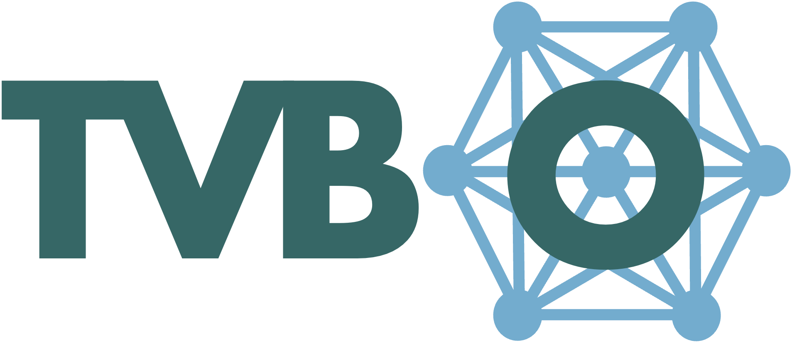

::: {.workshop-hero aria-labelledby="workshop-hero-title"}
<iframe class="workshop-hero__visual" src="brain-network-background.html" title="Animated brain network visualization" aria-hidden="true" tabindex="-1"></iframe>

::: {.workshop-hero__overlay aria-hidden="true"}
:::

::: {.workshop-hero__inner}
::: {.workshop-kicker}
[FAIR Brain Data Science Bootcamp](https://ebrains.eu/news-and-events/events/2026/fair-brain-data-science-bootcamp-2026) · Track 4
:::

# Mechanistic Whole-Brain Simulation Workshop {#workshop-hero-title}

::: {.workshop-hero__lead}
Personalized brain network modeling with The Virtual Brain, ontology-driven
model specification, and gradient-based optimization.
:::

::: {.workshop-hero__meta .d-flex .flex-wrap .gap-2 .mt-4 aria-label="Workshop details"}
[12-13 May 2026]{.workshop-hero__pill .badge .rounded-pill}
[Karolinska Institutet, Stockholm]{.workshop-hero__pill .badge .rounded-pill}
[Widerströmska huset]{.workshop-hero__pill .badge .rounded-pill}
:::

::: {.workshop-actions .d-flex .flex-wrap .gap-3 .mt-4}
[Start Setup](setup.qmd){.btn .btn-light .btn-lg}
[Open Slides](slides.qmd){.btn .btn-outline-light .btn-lg}
[View Agenda](agenda/agenda.qmd){.btn .btn-outline-light .btn-lg}
[Notebooks](notebooks/1_introduction.qmd){.btn .btn-outline-light .btn-lg}
:::
:::
:::

::: {.container-lg .mb-5}

## About

This two-day workshop introduces mechanistic whole-brain simulation with The
[Virtual Brain](https://thevirtualbrain.org), ontology-driven model
specification, and differentiable parameter optimization. Participants move
from model definition to simulation, analysis, and parameter fitting in
reproducible workflows.

The slides provide the conceptual map: brain network models, dynamical regimes,
FAIR model specification, and inference. The notebooks turn those ideas into
executable examples, including single-node dynamics, network coupling, noise,
parameter exploration, bifurcation analysis, optimization, and stimulation.
Examples connect the workflow to mechanistic and translational studies of
decision dynamics, cortical waves, and task/rest fMRI separation
[@Schirner2023; @Koller2024; @Kashyap2025].

### Learning Goals

- Specify brain network models as reusable, machine-readable metadata.
- Simulate local dynamics, network coupling, noise, and stimulation.
- Interpret phase planes, stability, bifurcations, and regime maps.
- Fit and compare model parameters with optimization workflows.
:::

::: {.container-lg .mb-5}
## Tools Used

:::: {.columns .workshop-tools}
::: {.column width="50%"}
::: {.card .h-100 .shadow-sm .workshop-tool-card}
::: {.card-body}
### [{.workshop-tool-logo fig-alt="TVB-O logo"}](https://virtual-twin.github.io/tvbo){.stretched-link}

Ontology-backed model specification for brain network simulations. `TVB-O`
captures equations, parameters, networks, coupling, integrators, observations,
and provenance in one reusable metadata record. It also provides a curated
database of published models and experiments and generates executable simulation
code [@Martin2025].
:::
:::
:::

::: {.column width="50%"}
::: {.card .h-100 .shadow-sm .workshop-tool-card}
::: {.card-body}
### [{.workshop-tool-logo fig-alt="TVB-Optim logo"}](https://virtual-twin.github.io/tvboptim){.stretched-link}

Differentiable and accelerator-ready inference workflows for whole-brain models.
`TVB-Optim` supports parallel simulation, automatic differentiation, and
gradient-based fitting of large parameter spaces [@Pille2025].
:::
:::
:::
::::
:::

::: {.container-lg .mb-5}
## References {.unnumbered}

::: {#refs}
:::
:::
