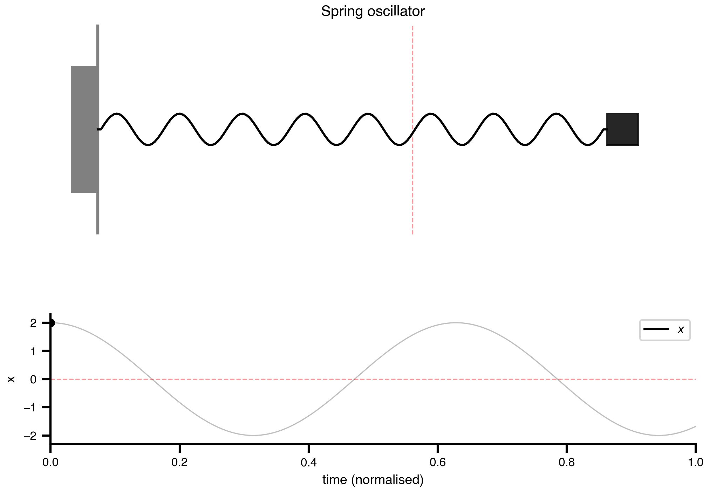
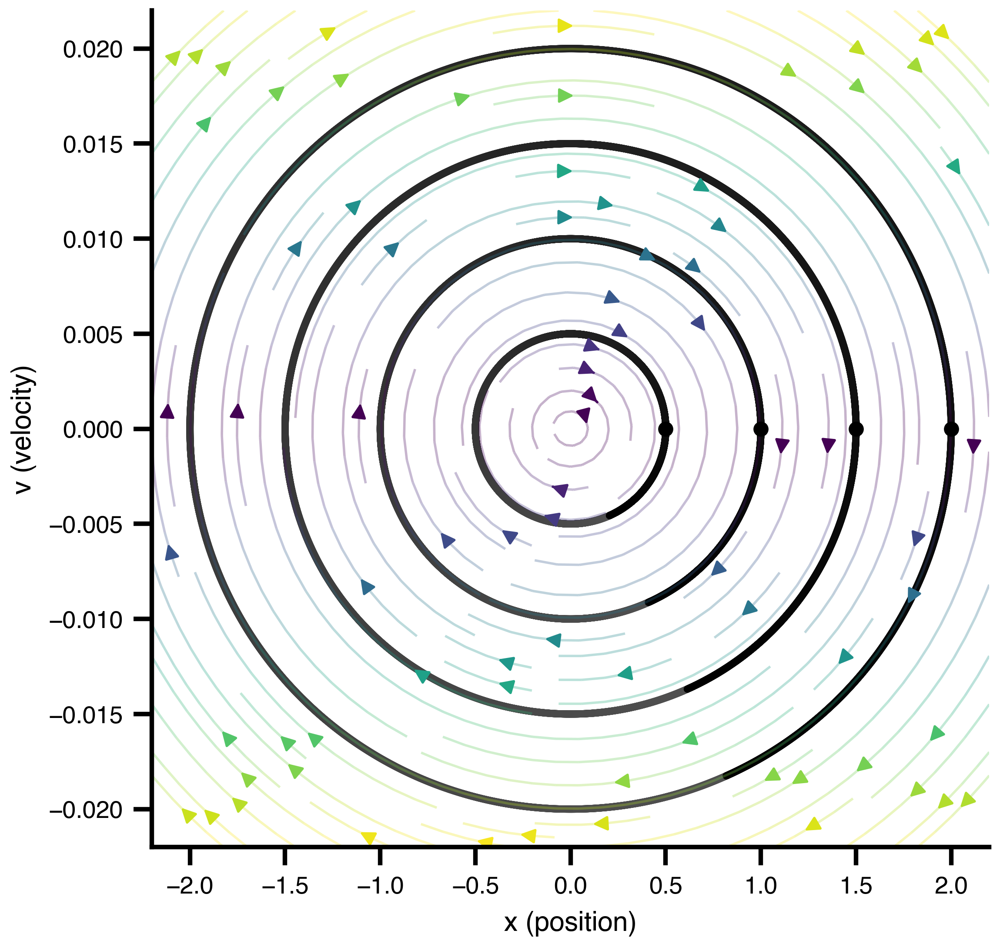
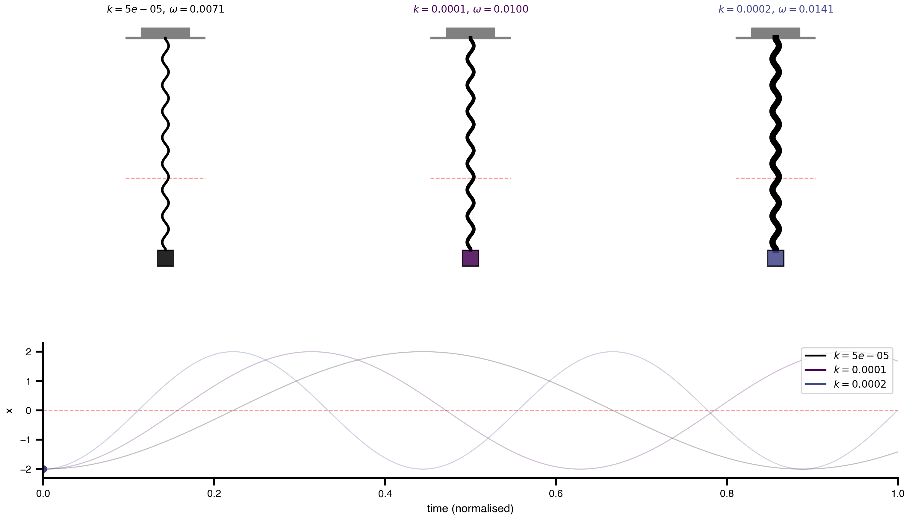
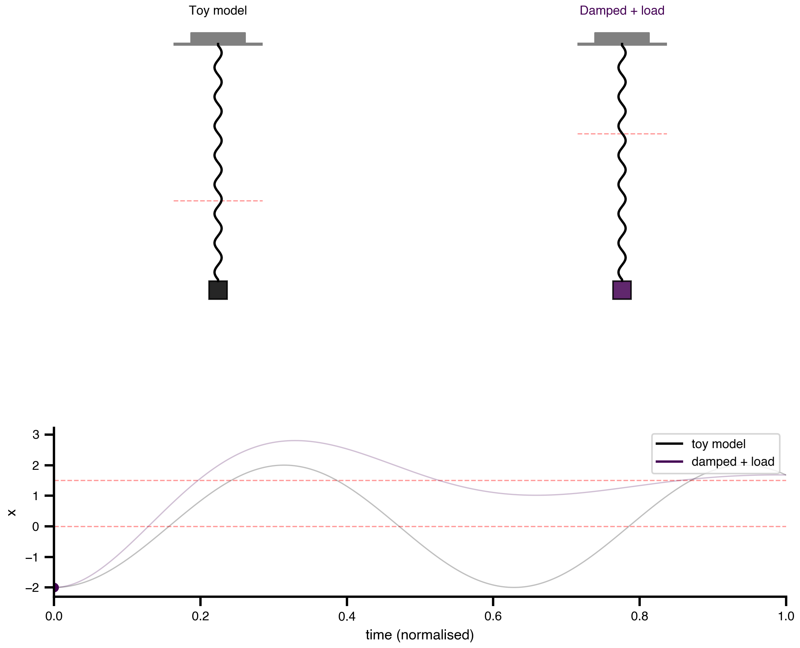

## Welcome {.unnumbered}

- Two-day hands-on workshop on personalized whole-brain modeling with TVB
- Day 1: structured sessions
- Day 2: mini hackathon — bring your own questions / data
- Useful links:
  - <https://thevirtualbrain.org>
  - <https://virtual-twin.github.io/tvbo>
  - <https://virtual-twin.github.io/tvboptim>

## Schedule {.unnumbered}

::: {.columns}
::: {.column width="50%"}
**Day 1**

1. Intro to TVB
2. Defining a FAIR brain network model
3. Dynamical perspective
4. Parameter exploration & optimization
5. Stimulating the brain
:::
::: {.column width="50%"}
**Day 2**

- Mini hackathon
- Bring your own data / research question
:::
:::

# 1. Intro to The Virtual Brain {background-color="#0b3d91"}
- TODO: motivation for whole-brain network modeling
- TODO: brief historical arc of TVB

## Basic ideas and history

:::: {.columns}
::: {.column width="25%"}
{width="100%"}
:::

::: {.column width="25%" .fragment}
{width="100%"}
:::

::: {.column width="25%" .fragment}
{width="100%"}
:::

::: {.column width="25%" .fragment}
{width="100%"}
:::

::::

## Mathematical framework

$$
dS_i = \left[f_d(S_i, \theta^d, C_i, I_i) \right]dt + g(S_i, \theta^g)\, dW_i
$$

::: {.fragment}

**State Evolution**

- $S_i$ - state variables at node $i$
- $f_d$ - dynamics function with parameters $\theta^d$
- $C_i$ - coupling input from connected nodes
- $I_i$ - external input (stimulation, driving signals)
- $g$ - noise diffusion coefficient with parameters $\theta^g$
- $dW_i$ - Wiener process (stochastic fluctuations)
:::

## The Spring Equation {background-color="#ffffff"}

$$
\dot{x} = v \qquad \dot{v} = -\frac{k}{m}\,x
$$

::: {.r-stack}
{fig-align="center" height="500px"}

{.fragment fig-align="center" height="500px"}
:::

## Initial Conditions {background-color="#ffffff"}

::: {.r-stack}
{fig-align="center" height="580px"}

{.fragment fig-align="center" height="580px"}
:::

## Phase Space {background-color="#ffffff"}

{fig-align="center" height="580px"}

## Parameters — Mass {background-color="#ffffff"}

::: {.r-stack}
{fig-align="center" height="580px"}

{.fragment fig-align="center" height="580px"}
:::

## Parameters — Stiffness {background-color="#ffffff"}

::: {.r-stack}
{fig-align="center" height="580px"}

{.fragment fig-align="center" height="580px"}
:::

## Towards Realism — Damping & Load {background-color="#ffffff"}

::: {.r-stack}
{fig-align="center" height="580px"}

{.fragment fig-align="center" height="580px"}
:::

## Neural Mass Models
- TODO: neural mass / mean-field formulation

## Network
- TODO: nodes, coupling, delays, noise

::: {.fragment fragment-index=2}
$$
C_i = f_c^{\text{post}}\Big(\sum_j A_{ij}\, f_c^{\text{pre}}(S_i, S_j(t-\tau_{ij}), \theta^c), S_i, \theta^c\Big)
$$

::: {style="font-size: 0.55em;"}
**Coupling**

- $f_c^{\text{pre}}$ - pre-aggregation transformation
- $A_{ij}$ - structural connectivity weight ($j \to i$)
- $\tau_{ij}$ - transmission delay (tract length / conduction speed)
- $f_c^{\text{post}}$ - post-aggregation transformation
- $\theta^c$ - coupling parameters
:::

:::

## Applications in basic research

- TODO: representative findings
- TODO: links to [@Schirner2023; @Koller2024; @Kashyap2025]

## Clinical applications

- TODO: translational use-cases
- TODO: virtual epileptic / Alzheimer / stroke patient examples

# 2. Defining a FAIR brain network model {background-color="#0b3d91"}

## Why FAIR? TVB-O in one slide

- TODO: ontology-driven model specification [@Martin2025]
- TODO: metadata + automated code generation

## 2.1 Mean field models

- TODO: notebook link
- TODO: pick a model, inspect parameters, simulate

## 2.2 Coupled network dynamics

- TODO: connectome loading
- TODO: global coupling sweep

# 3. Dynamical perspective {background-color="#0b3d91"}

## How to analyze a brain system

- TODO: fixed points, limit cycles, bifurcations

## 3.1 Bifurcation analysis

- TODO: 1D / 2D bifurcation diagrams
- TODO: interpretation in the brain-network context

# 4. Parameter exploration and model optimization {background-color="#0b3d91"}

## Brain network models as computational hypotheses

- TODO: framing — model fitting as hypothesis testing
- TODO: TVB-Optim overview [@Pille2025]

## Use-case A — Alzheimer's disease

- TODO: mechanistic simulation
- TODO: integration of biomedical data

## Use-case B — homogeneous vs. heterogeneous fitting

- TODO: frequency gradients (or another TVBase map)
- TODO: comparison protocol

# 5. Stimulating the brain {background-color="#0b3d91"}

## Visual and TMS-evoked potentials (Jansen–Rit)

- TODO: stimulation primitives in TVB
- TODO: VEP / TEP example

# Day 2 — Mini Hackathon {background-color="#0b3d91"}

## Format

- TODO: pitch your question (5 min each)
- TODO: form small groups
- TODO: checkpoint + wrap-up times

## Bring your own…

- TODO: data formats we can support
- TODO: EBRAINS / local setup reminder

# Wrap-up {background-color="#0b3d91"}

## Take-aways

- TODO: what to remember from Day 1
- TODO: where to go next

## Thanks & contact

- TODO: contact info
- TODO: feedback link

## References {.unnumbered}

::: {#refs}
:::

## {.unnumbered}

| {fig-alt="Charite logo" width=30%} | {fig-alt="BIH logo" width=30%} | {fig-alt="BSS logo" width=30%} |
|:---:|:---:|:---:|
