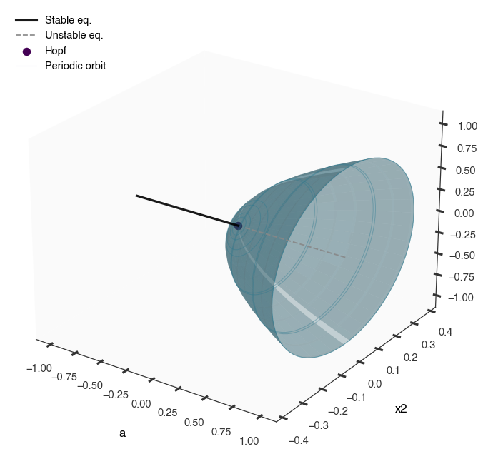
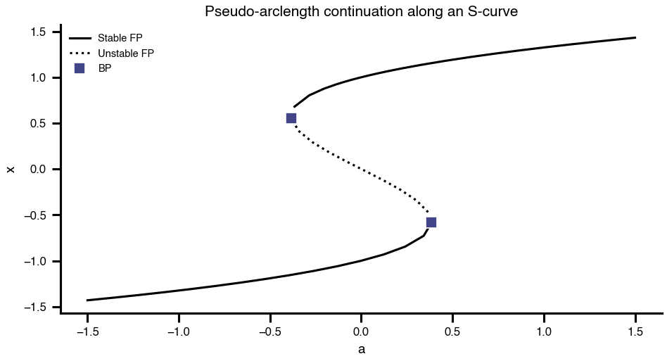

## Welcome {.unnumbered}

- Two-day hands-on workshop on personalized whole-brain modeling with TVB
- Day 1: structured sessions
- Day 2: mini hackathon — bring your own questions / data
- Useful links:
  - <https://thevirtualbrain.org>
  - <https://virtual-twin.github.io/tvbo>
  - <https://virtual-twin.github.io/tvboptim>

## Schedule {.unnumbered}

::: {.columns}
::: {.column width="60%" .smaller}
**Day 1**\
**Block 1 - 09:00-12:00:**\
1. Intro to Brain Network Modelling\
2. Defining a FAIR brain network model\
3. Dynamical perspective\
4. Setup & First examples

**Block 2 - 13:00-15:00:**\
5. Bifurcation Theory\
6. Parameter exploration & optimization

**Block 3 - 15:30-17:30:**\
7. Stimulating the brain
:::
::: {.column width="40%" .smaller}
**Day 2**\
**Block 1 - 09:00-11:30:**\
Mini hackathon - Bring your own data / research question


**Block 2 - 12:00-13:30:**\
Mini hackathon - Bring your own data / research question

:::
:::

# 1. Intro to The Virtual Brain {background-color="#0b3d91"}
- TODO: motivation for whole-brain network modeling
- TODO: brief historical arc of TVB

## Basic ideas and history

:::: {.columns}
::: {.column width="25%"}
{width="100%"}
:::

::: {.column width="25%" .fragment}
{width="100%"}
:::

::: {.column width="25%" .fragment}
{width="100%"}
:::

::: {.column width="25%" .fragment}
{width="100%"}
:::

::::


## Mathematical framework

$$
dS_i = \left[f_d(S_i, \theta^d, C_i, I_i) \right]dt + g(S_i, \theta^g)\, dW_i
$$


::: {.fragment}

**State Evolution**

- $S_i$ - state variables at node $i$
- $f_d$ - dynamics function with parameters $\theta^d$
- $C_i$ - coupling input from connected nodes
- $I_i$ - external input (stimulation, driving signals)
- $g$ - noise diffusion coefficient with parameters $\theta^g$
- $dW_i$ - Wiener process (stochastic fluctuations)
:::


## Dynamical Systems


:::: {.columns}

::: {.column style="font-size: 0.55em;"}

A mass $m$ on a spring with stiffness $k$. <br/>
Perpetual oscillation at $\omega = \sqrt{k/m}$.

**State Equations:**
$$
\dot{x} = v
$$
$$
\dot{v} = - \frac{k}{m}*x
$$

**State Variables**

| **Variable** | **Initial Value** | **Unit** | **Description** |
|--------------|-------------------|----------|-----------------|
| $x$ | 2.0 | $\mathrm{m}$ | Displacement from equilibrium |
| $v$ | 0.0 | $\frac{\mathrm{m}}{\mathrm{s}}$ | Velocity |

**Parameters**

| **Parameter** | **Value** | **Unit** | **Description** |
|---------------|-----------|----------|-----------------|
| $k$ | 0.0001 | $\frac{\mathrm{N}}{\mathrm{m}}$ | Spring stiffness constant |
| $m$ | 1.0 | $\mathrm{kg}$ | Mass of the oscillating body |


:::

::: {.column}

::: {.r-stack}

{fig-align="center"}

{.fragment fig-align="center"}
:::
:::

::::

## Initial Conditions {background-color="#ffffff"}


:::: {.columns}
::: {.column width="20%"}

::: {style="font-size: 0.8em;"}

$$
\dot{x} = v
$$
$$
\dot{v} = - \frac{k}{m}*x
$$
:::

:::
::: {.column width="80%"}
::: {.r-stack}
{fig-align="center"}

{.fragment fig-align="center" }
:::
:::

::::

## Phase Space {background-color="#ffffff"}

{fig-align="center" height="580px"}

## Parameters — Mass {background-color="#ffffff"}

::: {.r-stack}
{fig-align="center" height="580px"}

{.fragment fig-align="center" height="580px"}
:::


## Towards Realism — Damping & Load {background-color="#ffffff"}

::: {.r-stack}
{fig-align="center" height="580px"}

{.fragment fig-align="center" height="580px"}
:::

## Mean field models & Neural Masses

- TODO: notebook link
- TODO: pick a model, inspect parameters, simulate
- TODO: neural mass / mean-field formulation

## Coupled network dynamics
- TODO: nodes, coupling, delays, noise
- TODO: connectome loading
- TODO: global coupling sweep

::: {.fragment fragment-index=2}
$$
C_i = f_c^{\text{post}}\Big(\sum_j A_{ij}\, f_c^{\text{pre}}(S_i, S_j(t-\tau_{ij}), \theta^c), S_i, \theta^c\Big)
$$

::: {style="font-size: 0.55em;"}
**Coupling**

- $f_c^{\text{pre}}$ - pre-aggregation transformation
- $A_{ij}$ - structural connectivity weight ($j \to i$)
- $\tau_{ij}$ - transmission delay (tract length / conduction speed)
- $f_c^{\text{post}}$ - post-aggregation transformation
- $\theta^c$ - coupling parameters
:::

:::

# 2. Defining a FAIR brain network model {background-color="#0b3d91"}

## Why FAIR? TVB-O in one slide

- TODO: ontology-driven model specification [@Martin2025]
- TODO: metadata + automated code generation


## Applications in basic research

- TODO: representative findings
- TODO: links to [@Schirner2023; @Koller2024; @Kashyap2025]

## Clinical applications

- TODO: translational use-cases
- TODO: virtual epileptic / Alzheimer / stroke patient examples


# 3. Dynamical perspective {background-color="#0b3d91"}

## How to analyse a brain system

::: {.columns}
::: {.column width="33%" .smaller}
**Time series** — *what* the model does

Simulate trajectories $x(t)$ for fixed parameters. Direct comparison with EEG / fMRI signals; spectra, FC, FCD.
:::
::: {.column width="33%" .smaller}
**Phase plane** — *how* it does it

Vector field, nullclines and trajectories in state space. Reveals fixed points, basins of attraction and limit cycles **at one parameter value**.
:::
::: {.column width="34%" .smaller}
**Bifurcation diagram** — *when* it changes

Track equilibria and limit cycles **as a parameter varies**. Locates regime shifts, multistability, oscillation onset.
:::
:::

{fig-align="center" width="95%"}

::: {.smaller}
The three views are **complementary**: time series live at one $(a, x_0)$;
the phase plane shows the geometry around them; the bifurcation diagram
organises *all* of them into a single map of regimes. We use all three in
the rest of this section.
:::

## Linear stability — the simplest bifurcation

$$
\dot x = a\,x \quad\Rightarrow\quad x(t) = x_0\,e^{a t}
$$

::: {.columns}
::: {.column width="55%"}
- $a < 0$ → **stable** (decay); $a > 0$ → **unstable** (growth); $a = 0$ → **bifurcation point**
- For $\dot x = f(x)$ near a fixed point $x^\ast$, linearise: $\dot{\delta x} = J\,\delta x$ with $J = \partial f/\partial x|_{x^\ast}$
- **Stability** is read off the spectrum $\sigma(J) = \{\lambda_k\}$:
  $\max_k \mathrm{Re}\,\lambda_k < 0$ → stable
- A **bifurcation** occurs when an eigenvalue **crosses the imaginary axis** as a parameter changes
  - real $\lambda \to 0$: saddle-node / pitchfork / transcritical
  - complex pair $\alpha \pm i\omega \to \pm i\omega$: Hopf
:::
::: {.column width="45%"}
{width="100%"}
:::
:::

## 2D portraits — node, saddle, focus, centre

{fig-align="center" width="75%"}

## Codim-1 normal forms in the brain

{fig-align="center" width="95%"}

::: {.columns}
::: {.column width="33%" .smaller}
**Saddle-node** — $\dot x = a - x^2$. Two equilibria collide → **regime shift**.
:::
::: {.column width="33%" .smaller}
**Pitchfork** — $\dot x = a x - x^3$. **Symmetry breaking** → two new branches.
:::
::: {.column width="34%" .smaller}
**Hopf** — $\alpha\pm i\omega$ crosses zero → **limit cycle** of radius $\sqrt a$.
:::
:::

. . .

These are the **universal local pictures**: by the centre-manifold and
normal-form theorems, any smooth system close to such a bifurcation is
*locally diffeomorphic* to one of these few canonical equations. A small
tilt unfolds the pitchfork into a **hysteresis loop** — two saddle-nodes
framing a bistable region: the model *remembers its history*.

## Hopf — birth of an oscillation

::: {.columns}
::: {.column width="50%"}
{fig-align="center" width="100%"}
:::
::: {.column width="50%"}
{fig-align="center" width="100%"}
:::
:::

::: {.smaller}
Normal form: $\dot z = (a + i\omega)\,z - |z|^2 z$ with $z = x_1 + i x_2$.
As $a$ crosses 0 the spiral **inverts** and a stable limit cycle of radius
$\sqrt a$ is born — exactly the orbit traced in the GIF.
:::

## Numerical continuation in one slide

::: {.columns}
::: {.column width="55%"}
- Track $F(x, a) = 0$ along **arclength** $s$, not along $a$ — solves
  $\bigl[F(x,a),\; \langle (x,a) - (x_0,a_0), t_0 \rangle - \Delta s\bigr] = 0$
- **Predictor**: tangent $t_0 \in \ker J_{(x,a)}F$ → **Corrector**: Newton on the augmented system
- Walks **through folds** where $\partial F/\partial x$ is singular (the parameter is no longer a function of the state)
- Bifurcations detected via **test functions**: $\det J = 0$ (fold), $\mathrm{Re}\,\lambda = 0$ with $\mathrm{Im}\,\lambda \ne 0$ (Hopf)
- **Branch switching** at a Hopf restarts along the centre eigenvector → continues the periodic orbit
:::
::: {.column width="45%"}
{width="100%"}
:::
:::

. . .

In TVBO, all of this is one YAML and one call:

```python
result = exp.run("bifurcationkit.jl")
result.continuations["my_cont"].plot_3d(VOI="x1")
```

## Generic2dOscillator — brain-relevant example

{fig-align="center" width="75%"}

## 3.1 Bifurcation analysis — hands-on

- Notebook: [`notebooks/03_bifurcation_analysis.qmd`](notebooks/03_bifurcation_analysis.qmd)
- Same `Continuation` schema, single backend (`bifurcationkit.jl`)
- Run on the **Generic2dOscillator** (TVB neural mass): sweep input $I$, continue periodic orbits from each Hopf
- **Reading the diagram:**
  - stable branch → resting / persistent activity
  - limit cycle → oscillatory regime
  - fold → abrupt regime shift (e.g. seizure onset)

# 4. Parameter exploration and model optimization {background-color="#0b3d91"}

## Brain network models as computational hypotheses

- TODO: framing — model fitting as hypothesis testing
- TODO: TVB-Optim overview [@Pille2025]

## Use-case A — Alzheimer's disease

- TODO: mechanistic simulation
- TODO: integration of biomedical data

## Use-case B — homogeneous vs. heterogeneous fitting

- TODO: frequency gradients (or another TVBase map)
- TODO: comparison protocol

# 5. Stimulating the brain {background-color="#0b3d91"}

## Visual and TMS-evoked potentials (Jansen–Rit)

- TODO: stimulation primitives in TVB
- TODO: VEP / TEP example

# Day 2 — Mini Hackathon {background-color="#0b3d91"}

## Format

- TODO: pitch your question (5 min each)
- TODO: form small groups
- TODO: checkpoint + wrap-up times

## Bring your own…

- TODO: data formats we can support
- TODO: EBRAINS / local setup reminder

# Wrap-up {background-color="#0b3d91"}

## Take-aways

- TODO: what to remember from Day 1
- TODO: where to go next

## Thanks & contact

- TODO: contact info
- TODO: feedback link

| {fig-alt="Charite logo" width=30%} | {fig-alt="BIH logo" width=30%} | {fig-alt="BSS logo" width=30%} |
|:---:|:---:|:---:|

## References {.unnumbered}

::: {#refs}
:::

## {.unnumbered}


