## Welcome {.unnumbered}

- Two-day hands-on workshop on personalized whole-brain modeling with TVB
- Day 1: structured sessions
- Day 2: mini hackathon — bring your own questions / data
- Useful links:
  - <https://thevirtualbrain.org>
  - <https://virtual-twin.github.io/tvbo>
  - <https://virtual-twin.github.io/tvboptim>

## Schedule {.unnumbered}

::: {.columns}
::: {.column width="60%" .smaller}
**Day 1**\
**Block 1 - 09:00-12:00:**\
1. Intro to Brain Network Modelling\
2. Defining a FAIR brain network model\
3. Applications in Basic and Clinical Research\
4. Setup & First examples

**Block 2 - 13:00-15:00:**\
5. Bifurcation Theory\
6. Parameter exploration & inference I

**Block 3 - 15:30-17:30:**\
7. Parameter exploration & inference II\
8. Stimulating the brain

:::
::: {.column width="40%" .smaller}
**Day 2**\
**Block 1 - 09:00-11:30:**\
Mini hackathon - Bring your own data / research question\
Plotting the Brain


**Block 2 - 12:00-13:30:**\
Mini hackathon - Bring your own data / research question\
Plotting the Brain

:::
:::

# 1. Intro to Brain Network Modelling {background-color="#6880af"}
- TODO: motivation for whole-brain network modeling
- TODO: brief historical arc of TVB

## Basic ideas and history

:::: {.rows}
::: {.row height=60%}
:::: {.columns}
::: {.column width="25%"}
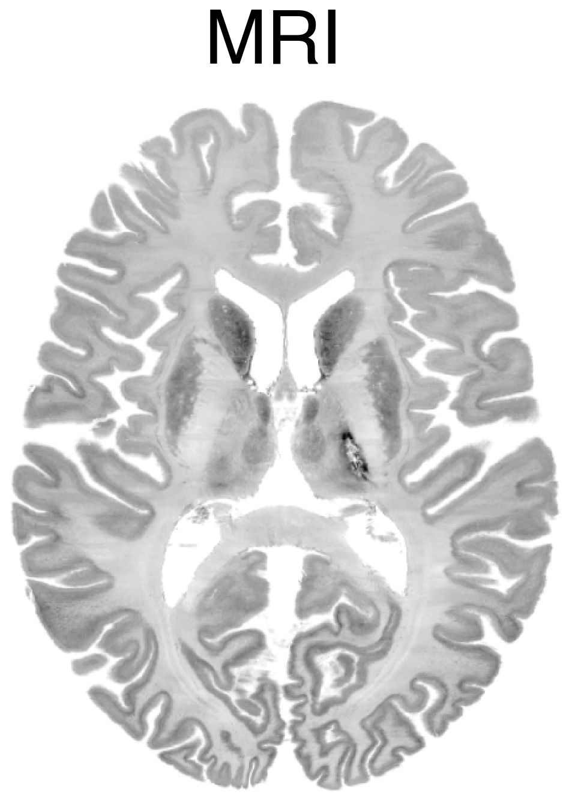{width="100%"}
:::

::: {.column width="25%" .fragment}
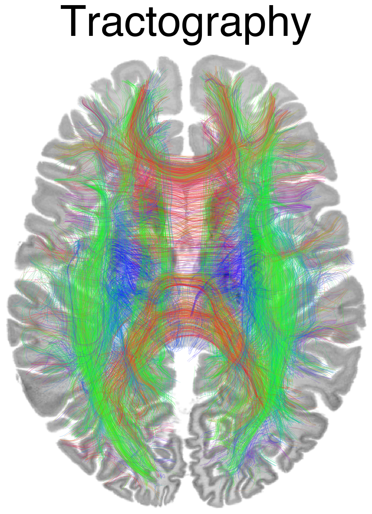{width="100%"}
:::

::: {.column width="25%" .fragment}
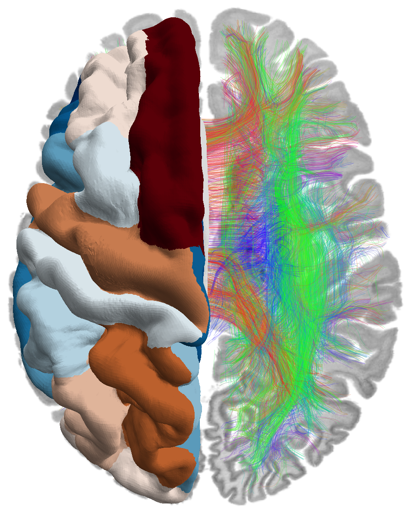{width="100%"}
:::

::: {.column width="25%" .fragment}
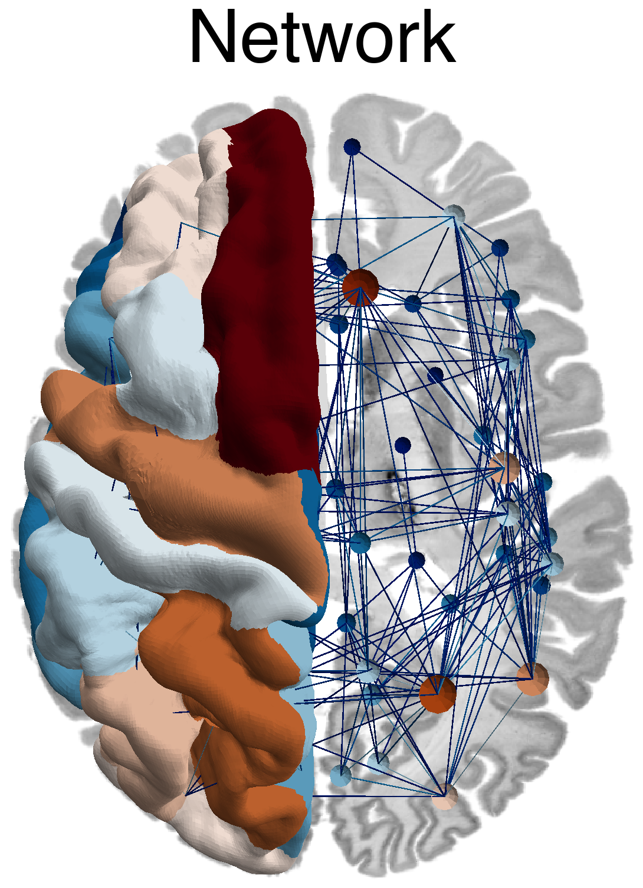{width="100%"}
:::

::::
:::

::: {.row height=40% .fragment}
:::: {.columns}

::: {.column width="70%"}
```{mermaid}
%%| fig-align: center
flowchart LR
    S(["State:  $$ S(t) $$"]):::box --> F["Evolution Function:  $$ f(S, θ)$$"]:::fn --> dS(["Next State:  $$ dS/dt $$ "]):::box
    theta(["Parameters:  $$\theta$$"]):::param --> F

    classDef box  fill:#d6e4f0,stroke:#6880af,stroke-width:2px,color:#1a1a2e,rx:8,ry:8
    classDef fn   fill:#6880af,stroke:#3a5080,stroke-width:2px,color:#ffffff,font-weight:bold,rx:4,ry:4
    classDef param fill:#f0dfd6,stroke:#af8068,stroke-width:2px,color:#1a1a2e,rx:8,ry:8
```
:::

::: {.column width="30%"}
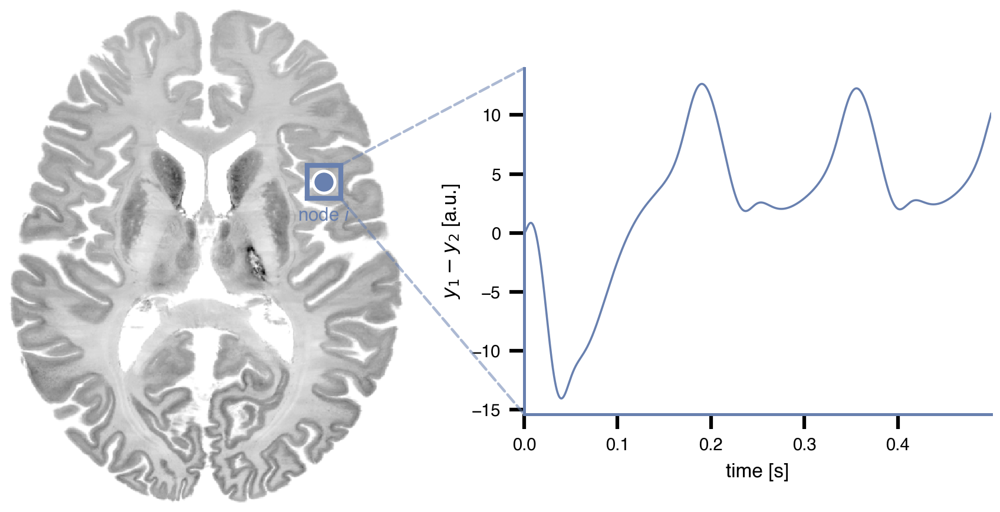{height=150px}
:::

::::
:::
::::


## Mathematical framework

$$
dS_i = \left[f_d(S_i, \theta^d, C_i, I_i) \right]dt + g(S_i, \theta^g)\, dW_i
$$


::: {.fragment}

**State Evolution**

- $S_i$ - state variables at node $i$
- $f_d$ - dynamics function with parameters $\theta^d$
- $C_i$ - coupling input from connected nodes
- $I_i$ - external input (stimulation, driving signals)
- $g$ - noise diffusion coefficient with parameters $\theta^g$
- $dW_i$ - Wiener process (stochastic fluctuations)
:::


## Dynamical Systems


:::: {.columns}

::: {.column style="font-size: 0.55em;"}

A mass $m$ on a spring with stiffness $k$. <br/>
Perpetual oscillation at $\omega = \sqrt{k/m}$.

**State Equations:**
$$
\dot{x} = v
$$
$$
\dot{v} = - \frac{k}{m}*x
$$

**State Variables**

| **Variable** | **Initial Value** | **Unit** | **Description** |
|--------------|-------------------|----------|-----------------|
| $x$ | 2.0 | $\mathrm{m}$ | Displacement from equilibrium |
| $v$ | 0.0 | $\frac{\mathrm{m}}{\mathrm{s}}$ | Velocity |

**Parameters**

| **Parameter** | **Value** | **Unit** | **Description** |
|---------------|-----------|----------|-----------------|
| $k$ | 0.0001 | $\frac{\mathrm{N}}{\mathrm{m}}$ | Spring stiffness constant |
| $m$ | 1.0 | $\mathrm{kg}$ | Mass of the oscillating body |


:::

::: {.column}

::: {.r-stack}

{fig-align="center"}

{.fragment fig-align="center"}
:::
:::

::::

## Initial Conditions {background-color="#ffffff"}


:::: {.columns}
::: {.column width="20%"}

::: {style="font-size: 0.8em;"}

$$
\dot{x} = v
$$
$$
\dot{v} = - \frac{k}{m}*x
$$
:::

:::
::: {.column width="80%"}
::: {.r-stack}
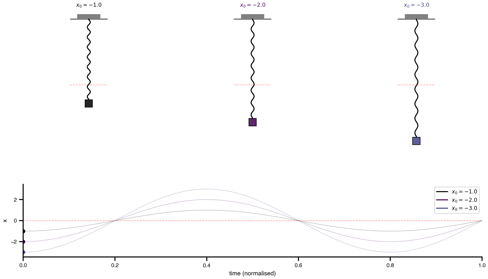{fig-align="center"}

{.fragment fig-align="center" }
:::
:::

::::

## Phase Space {background-color="#ffffff"}

{fig-align="center" height="580px"}

## Parameters — Mass {background-color="#ffffff"}

::: {.r-stack}
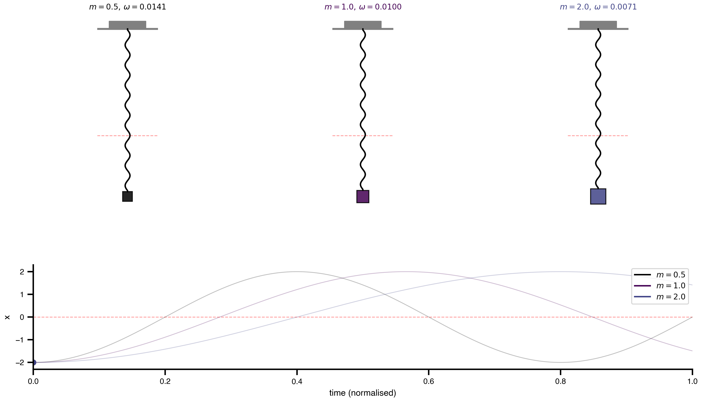{fig-align="center" height="580px"}

{.fragment fig-align="center" height="580px"}
:::


## Towards Realism — Damping & Load {background-color="#ffffff"}

::: {.r-stack}
{fig-align="center" height="580px"}

{.fragment fig-align="center" height="580px"}
:::

# Mean Field Models {background-video="img/videos/birds.mp4" background-video-loop="true" background-video-muted="true"}


## Mean field models & Neural Masses

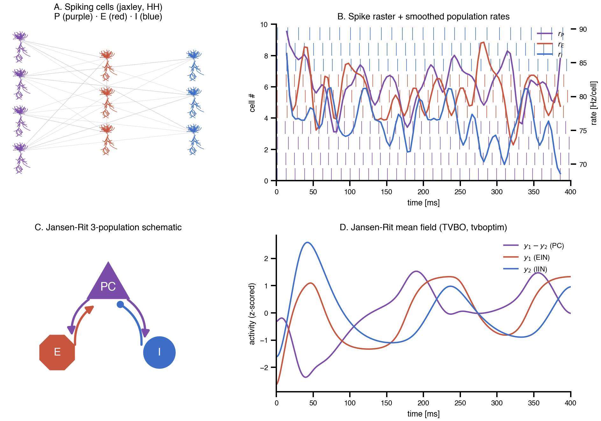{fig-align="center" width="100%"}

- Population rate: $r(t) = \langle \#\text{spikes}\rangle / (N\,\Delta t)$
- Jansen-Rit (3 populations): PC = $y_1 - y_2$, the EEG-like PSP at pyramidal cells

## Network dynamics

```{python}
from tvbo import Network
net = Network.from_string("""
label: Visual Pathway

nodes:
  - {id: 0, label: V1}
  - {id: 1, label: V2}
  - {id: 2, label: MT}

edges:
  - source: 0
    target: 1
    parameters:
      weight:
        value: 0.7
  - source: 1
    target: 2
    parameters:
      weight:
        value: 0.4
  - source: 0
    target: 2
    parameters:
      weight:
        value: 0.2
""")

net.plot_overview()
```

## Uncoupled system


## Coupled system

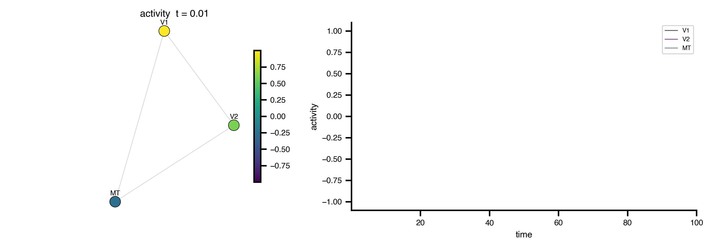

## Coupled Brain Network
<!-- - TODO: nodes, coupling, delays, noise
- TODO: connectome loading
- TODO: global coupling sweep -->

:::: {.columns}

::: {.column width=20%}
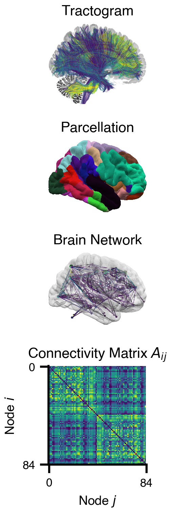{height=590px}
:::

::: {.column width=80%}

::: {.fragment fragment-index=2}
$$
C_i = f_c^{\text{post}}\Big(\sum_j A_{ij}\, f_c^{\text{pre}}(S_i, S_j(t-\tau_{ij}), \theta^c), S_i, \theta^c\Big)
$$

::: {style="font-size: 0.55em;"}
**Coupling**

- $f_c^{\text{pre}}$ - pre-aggregation transformation
- $A_{ij}$ - structural connectivity weight ($j \to i$)
- $\tau_{ij}$ - transmission delay (tract length / conduction speed)
- $f_c^{\text{post}}$ - post-aggregation transformation
- $\theta^c$ - coupling parameters

:::

:::

::: {.fragment fragment-index=3}
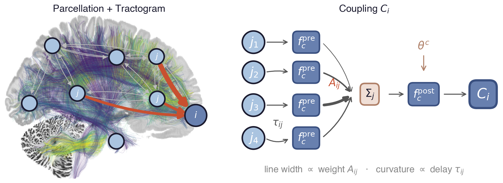{height="250px" fig-align="center"}
:::

:::

::::

# 2. Defining a FAIR brain network model {background-color="#6880af"}

## Why FAIR? TVB-O in one slide


## Why FAIR? TVB-O in one slide

```{=html}
<style>
.se-dia {
  font-family: system-ui, -apple-system, 'Segoe UI', sans-serif;
  background: linear-gradient(145deg, #f4f8f8, #e4edef);
  border: 2px solid #9ab5b8; border-radius: 18px;
  padding: 20px 22px 18px; width: 100%; box-sizing:border-box;
  margin: 0 auto; box-shadow: 0 6px 32px rgba(43,122,120,.1);
}
.se-dia .hdr { text-align:center; font-size:1.15em; font-weight:700; color:#2b6b6b; letter-spacing:.03em; margin-bottom:12px; }
.se-dia .top { display:grid; grid-template-columns:3fr 2fr; grid-template-rows:auto auto; gap:10px; margin-bottom:12px; }
.se-dia .top .net { grid-row:1/3; }
.se-dia .bot { display:flex; gap:10px; }
.se-dia .g { border:1.5px dashed; border-radius:12px; padding:10px 12px 12px; min-width:0; display:flex; flex-direction:column; }
.se-dia .gl { font-size:.54em; font-weight:700; text-transform:uppercase; letter-spacing:.09em; margin-bottom:6px; padding-left:2px; }
.se-dia .pp { display:flex; flex-wrap:wrap; gap:5px 6px; align-items:center; }
.se-dia .p  { display:inline-flex; align-items:center; padding:4px 10px; border-radius:16px; font-size:.52em; font-weight:500; white-space:nowrap; border:1.2px solid; line-height:1.3; }
.se-dia .sub { border-radius:9px; padding:7px 10px 8px; margin-top:7px; }
.se-dia .sub .gl { font-size:.48em; margin-bottom:3px; }
.se-dia .f1  { flex:1; }
.se-dia .f08 { flex:.8; }
.se-dia .arr { font-size:.48em; color:#6a9a9a; margin:0 2px; line-height:1; font-weight:300; }
.se-dia .p.opt { border-style:dashed; opacity:.7; }
/* Network: blue */
.g.c-net        { border-color:#8bbde0; background:rgba(200,225,240,.25); }
.g.c-net > .gl  { color:#2e6e9c; }
.p.c-net        { background:#9dd0f0; border-color:#5ea8d4; color:#1a4a6e; }
.g.c-net .sub        { border:1.2px solid #a8d0e8; background:rgba(210,230,245,.35); }
.g.c-net .sub .gl    { color:#4a8ab8; }
.p.c-dyn        { background:#bee0f4; border-color:#7ec0e0; color:#1e5a80; }
.p.c-cpl        { background:#d0e8f6; border-color:#98cce6; color:#2a6890; }
/* Integration: teal */
.g.c-int        { border-color:#7abab8; background:rgba(180,220,218,.25); }
.g.c-int > .gl  { color:#2b6b6b; }
.p.c-int        { background:#8ad0cc; border-color:#52a8a4; color:#1a4e4e; }
/* Event: amber */
.g.c-evt        { border-color:#d4c4a0; background:rgba(230,218,195,.25); }
.g.c-evt > .gl  { color:#8a6a30; }
.p.c-evt        { background:#e8d4b0; border-color:#c8a870; color:#5a4420; }
.g.c-evt .sub        { border:1.2px solid #d8c8a8; background:rgba(235,225,205,.35); }
.g.c-evt .sub .gl    { color:#9a7a40; }
.p.c-stm        { background:#f0e0c4; border-color:#d4b888; color:#6a5030; }
/* Observation: cyan-teal */
.g.c-obs        { border-color:#88c4c4; background:rgba(190,225,225,.25); }
.g.c-obs > .gl  { color:#2e7070; }
.p.c-obs        { background:#98d4d0; border-color:#5eb0ac; color:#1a5050; }
/* Exploration: green */
.g.c-exp        { border-color:#98c8a4; background:rgba(200,230,210,.25); }
.g.c-exp > .gl  { color:#3a7048; }
.p.c-exp        { background:#a8d8b4; border-color:#70b480; color:#1e4a2a; }
/* Analysis: slate blue */
.g.c-ana        { border-color:#98a8c4; background:rgba(200,210,228,.25); }
.g.c-ana > .gl  { color:#3a5070; }
.p.c-ana        { background:#b0c0d8; border-color:#7898b8; color:#1e3450; }
/* Environment: warm gray */
.g.c-env        { border-color:#b0b8b8; background:rgba(215,220,220,.25); }
.g.c-env > .gl  { color:#505858; }
.p.c-env        { background:#c4cccc; border-color:#94a0a0; color:#2a3434; }
</style>
<div class="se-dia">
  <div class="hdr">SimulationExperiment</div>
  <div class="top">
    <div class="g c-net net">
      <div class="gl">Network</div>
      <div class="pp">
        <span class="p c-net opt">Parcellation</span>
        <span class="arr">⟶</span>
        <span class="p c-net">Node</span>
        <span class="arr">⟶</span>
        <span class="p c-net">Edge</span>
      </div>
      <div class="sub">
        <div class="gl">Dynamics</div>
        <div class="pp">
          <span class="p c-dyn">StateVariable</span>
          <span class="p c-dyn">Parameter</span>
          <span class="p c-dyn">Equation</span>
          <span class="p c-dyn">DerivedVariable</span>
          <span class="p c-dyn">DerivedParameter</span>
          <span class="p c-dyn">Function</span>
        </div>
      </div>
      <div class="sub">
        <div class="gl">Coupling</div>
        <div class="pp">
          <span class="p c-cpl">Parameter</span>
          <span class="p c-cpl">Equation</span>
          <span class="p c-cpl">IncomingState</span>
          <span class="p c-cpl">LocalState</span>
        </div>
      </div>
    </div>
    <div class="g c-int">
      <div class="gl">Integration</div>
      <div class="pp">
        <span class="p c-int">Method</span>
        <span class="p c-int">Noise</span>
        <span class="p c-int">InitialCondition</span>
        <span class="p c-int">TimeSeries</span>
      </div>
    </div>
    <div class="g c-evt">
      <div class="gl">Event</div>
      <div class="pp">
        <span class="p c-evt">Equation</span>
        <span class="p c-evt">Target</span>
      </div>
      <div class="sub">
        <div class="gl">Stimulus</div>
        <div class="pp">
          <span class="p c-stm">Waveform</span>
        </div>
      </div>
    </div>
  </div>
  <div class="bot">
    <div class="g c-obs f1">
      <div class="gl">Observation</div>
      <div class="pp">
        <span class="p c-obs">Source</span>
        <span class="p c-obs">Pipeline</span>
        <span class="arr">⟶</span>
        <span class="p c-obs">DataSource</span>
        <span class="p c-obs">DerivedObs.</span>
      </div>
    </div>
    <div class="g c-exp f08">
      <div class="gl">Exploration</div>
      <div class="pp">
        <span class="p c-exp">Exploration</span>
        <span class="p c-exp">Algorithm</span>
      </div>
    </div>
    <div class="g c-ana f08">
      <div class="gl">Analysis</div>
      <div class="pp">
        <span class="p c-ana">Optimization</span>
        <span class="p c-ana">Continuation</span>
      </div>
    </div>
    <div class="g c-env f1">
      <div class="gl">Environment</div>
      <div class="pp">
        <span class="p c-env">SoftwareEnv.</span>
        <span class="p c-env">Execution</span>
        <span class="p c-env">Reference</span>
        <span class="p c-env">Author</span>
      </div>
    </div>
  </div>
</div>
```

## Applications in basic research

- TODO: representative findings
- TODO: links to [@Schirner2023; @Koller2024; @Kashyap2025]

## Clinical applications

- TODO: translational use-cases
- TODO: virtual epileptic / Alzheimer / stroke patient examples

# Setup & First Examples


# 3. Bifurcation Analysis {background-color="#6880af"}

## How to analyse a brain system

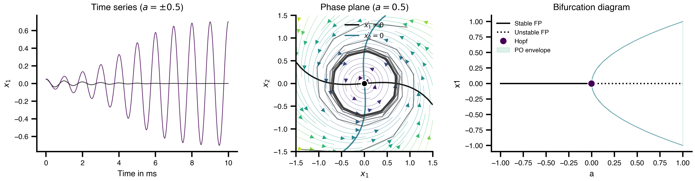{fig-align="center" width="96%"}

::: {.columns}
::: {.column width="33%" .smaller}
**Time series**
$x(t)$ at fixed $(a, x_0)$
:::
::: {.column width="33%" .smaller}
**Phase plane**
flow geometry at fixed $a$
:::
::: {.column width="34%" .smaller}
**Bifurcation diagram**
regimes as $a$ varies
:::
:::

## Linear Systems


:::: {.columns}

::: {.column width="30%" .r-fit-text}
$$
\dot x = a\,x \quad\Rightarrow\quad x(t) = x_0\,e^{a t}
$$

- $x(t)$: State variable
- $x_0$: Initial condition
- $a$: Parameter

Solution:
$$
x(t) = x_0\,e^{a t}
$$

Equilibrium:
$$
\dot{x}(t) = ax(t) = 0?
$$
$$
\quad\Rightarrow\quad x_{eq} = 0
$$


:::

::: {.column width="50%"}
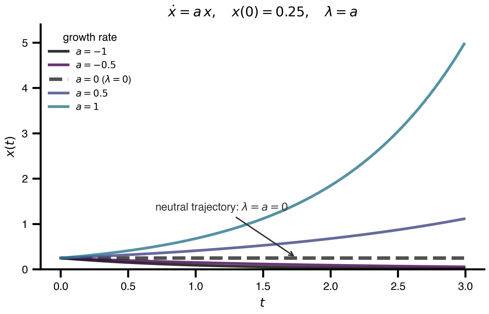{width="100%"}
:::

::: {.column width=10%}

- $\lambda=a$: growth rate
- $a < 0$: decay
- $a = 0$: marginal
- $a > 0$: growth
- **change point:** $\lambda=a=0$

:::

::::

## 2D portraits

- TODO: Add Timeseries to Phase Planes

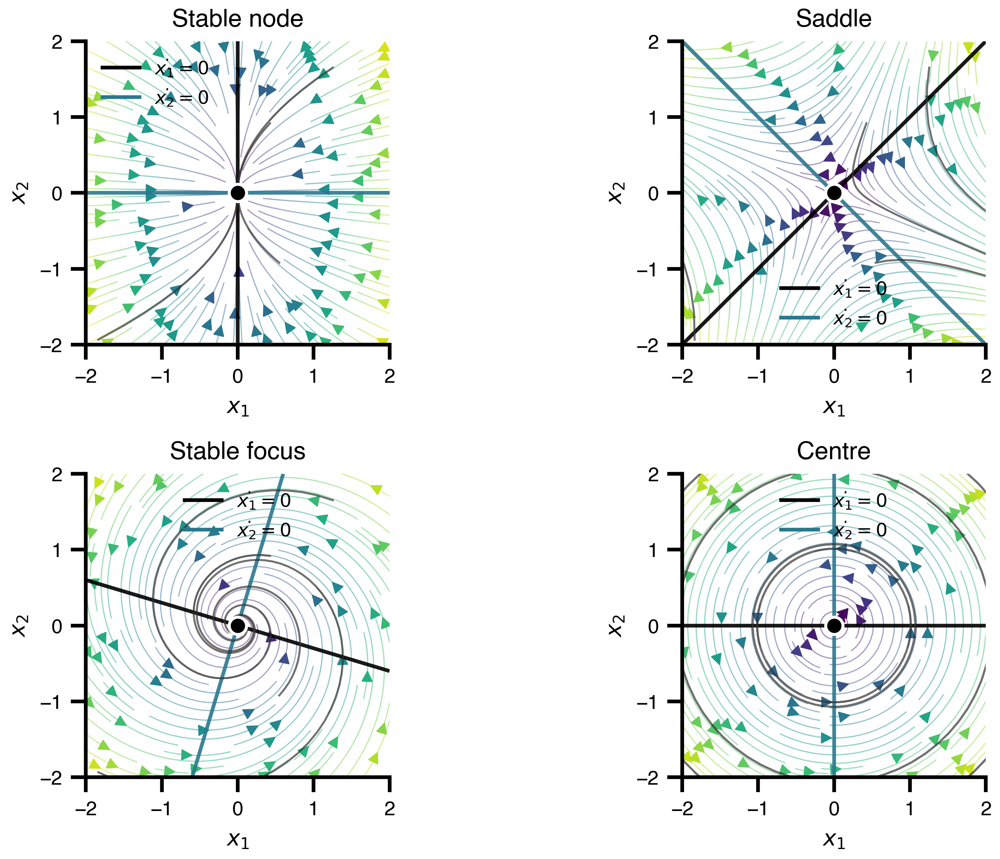{fig-align="center" width="82%"}

::: {.smaller}
**Same local rule:** arrows define the flow; trajectories reveal attraction, repulsion, rotation and separatrices.
:::

## Regime-change building blocks

:::: {.columns}

::: {.column .smaller width=20%}

- Top: equilibria as $a$ varies.
- Bottom: local flow $\dot x=f(x)$ at the dotted parameter slice.

:::

::: {.column width=80%}
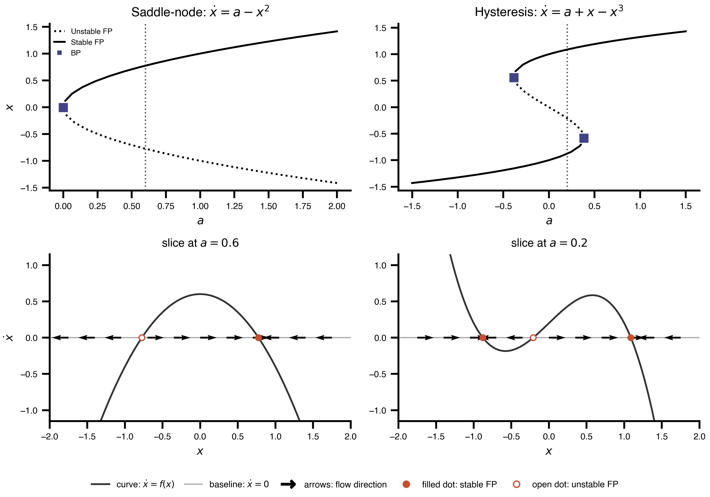{fig-align="center" width="100%"}
:::

::::


## Hopf: birth of an oscillation

$$
\dot z = (a + i\omega)z - |z|^2z,
\qquad r_{\mathrm{cycle}} = \sqrt a
$$

{fig-align="center" width="100%"}

::: {.smaller}
fixed point loses stability $\Rightarrow$ stable oscillation appears
:::


## Generic2dOscillator: regimes over input $I$

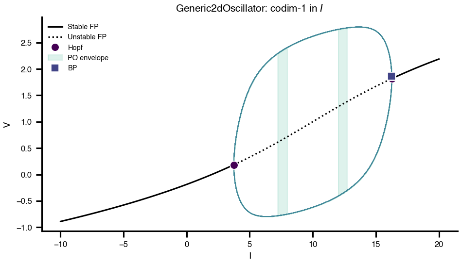{fig-align="center" width="82%"}

::: {.smaller}
resting branch | oscillatory window | folds and Hopf points
:::


## Numerical continuation {.r-fit-text}

::: {.columns}
::: {.column width="62%"}
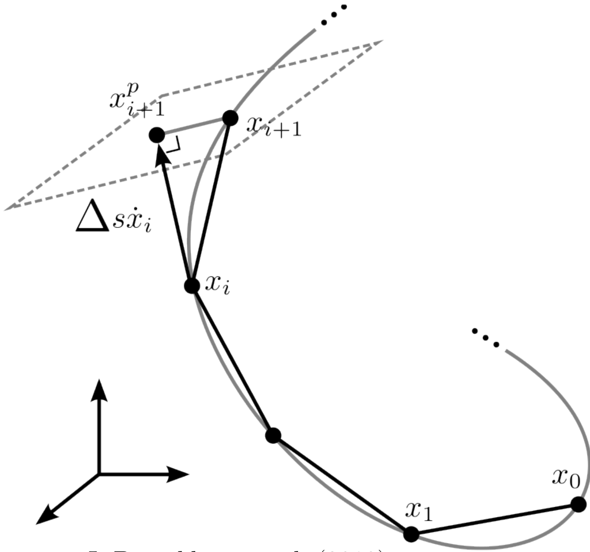
:::
::: {.column width="38%" .smaller}
$$
F(x, a)=0,
\qquad (x,a)=(x(s),a(s))
$$

- follow branches through folds
- detect folds and Hopf points
- switch to periodic orbits

:::
:::


## TVB simulation infused with bifurcation analysis

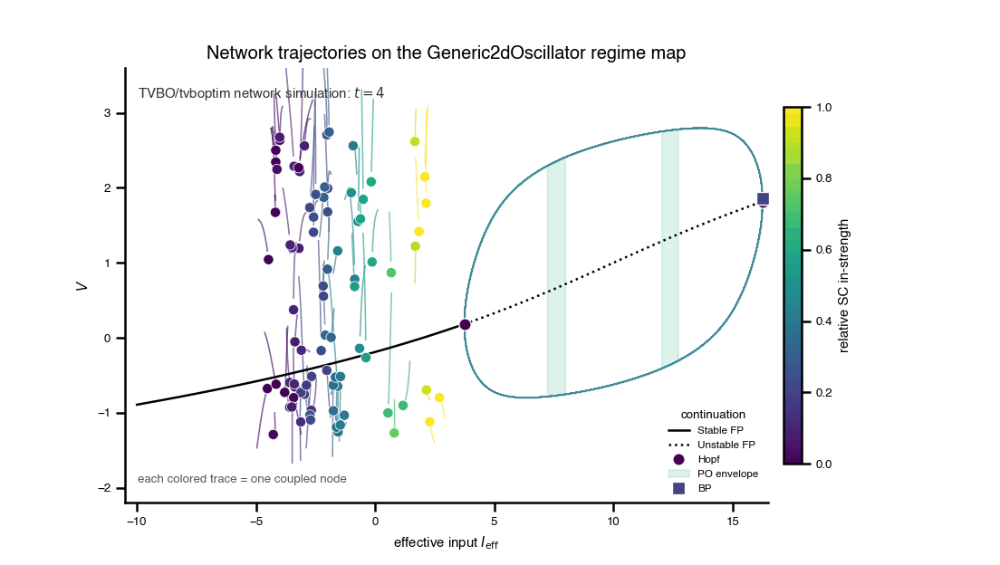{fig-align="center" width="100%"}

::: {.smaller}
TVBO + tvboptim simulation of Generic2dOscillator on the Desikan-Killiany network. Nodes are colored by their instantaneous $V(t)$ and projected onto axial (top) and sagittal views; the regime map places each node at its current $(I_{\mathrm{eff}}, V)$ on the bifurcation diagram.
:::


## 3.1 Bifurcation analysis: hands-on

- Notebook: [`notebooks/03_bifurcation_analysis.qmd`](notebooks/03_bifurcation_analysis.qmd)
- Sweep input $I$ in a TVB neural mass model
- Continue fixed points and periodic orbits
- Read the diagram as a **map of regimes**

```python
result = exp.run("bifurcationkit.jl")
```




<!-- section 4 lives in _slides-section-4.qmd to keep diffs scoped and
     reduce merge conflicts when collaborators touch slides.qmd -->


# 5. Stimulating the brain {background-color="#6880af"}

## Visual evoked potentials

[@Jansen1995]

::::: {.columns}

:::: {.column width="30%"}
**Original**

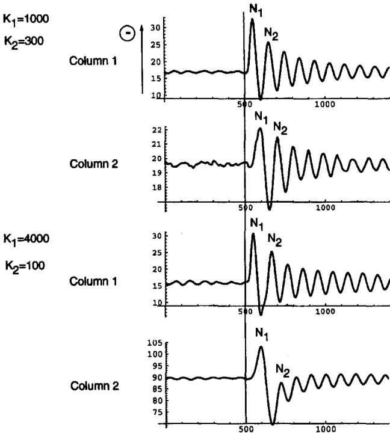
::::

:::: {.column width="40%"}
**Specification**

```yaml {code-line-numbers="|1-18|19-36|37-54|55-72|73-87"}
- id: 6
  label: "VEP: different columns, with delay
          (Fig. 11)"
  dynamics:
    name: JansenRit1995_Delayed_VEP
    parameters:
      A: {value: 3.25, unit: mV}
      B: {value: 22, unit: mV}
      C: {value: 135}
      a: {value: 100, unit: s^-1}
      b: {value: 50, unit: s^-1}
      v0: {value: 6, unit: mV}
      e0: {value: 2.5, unit: s^-1}
      r: {value: 0.56, unit: mV^-1}
      p:
        value: 220
        unit: s^-1
        shape: "(n_nodes,)"
        distribution: *dist_p_uniform
      a_d: {value: 30, unit: s^-1}
      K: {value: 0, shape: "(n_nodes,)"}
    derived_parameters: *jr_derived
    functions: *jr_functions
    coupling_terms: *jr_coupling
    state_variables:
      y0: {equation: {rhs: y3}}
      y3:
        equation:
          rhs: >-
            A*a*Sigm(y1 - y2)
            - 2*a*y3 - a**2*y0
      y1: {equation: {rhs: y4}}
      y4:
        equation:
          rhs: >-
            A*a*(p + P
            + C2*Sigm(C1*y0) + z0)
            - 2*a*y4 - a**2*y1
      y2: {equation: {rhs: y5}}
      y5:
        equation:
          rhs: >-
            B*b*(C4*Sigm(C3*y0))
            - 2*b*y5 - b**2*y2
      z0: {equation: {rhs: z1}}
      z1:
        equation:
          rhs: >-
            A*a_d*K*c_intercolumn
            - 2*a_d*z1 - a_d**2*z0
    derived_variables:
      v_pyr: {equation: {rhs: y1 - y2}}
    output: [v_pyr]
  network:
    number_of_regions: 2
    number_of_nodes: 2
    conduction_speed: {value: 0}
    nodes:
      - {id: 0}
      - id: 1
        parameters:
          B: {value: 17.6}
          C: {value: 108}
    edges:
      - source: 0
        target: 1
        directed: true
      - source: 1
        target: 0
        directed: true
    coupling: *sigmoidal_coupling
  events: *flash_events
  integration: *integration_vep
  execution:
    random_seed: 42
  explorations:
    VEP_delayed_fig11:
      mode: zip
      n_trials: 40
      average: trials
      parameters:
        K:
          element_domains:
            - element: 0
              explored_values: [300, 100]
            - element: 1
              explored_values: [1000, 4000]
```
::::

:::: {.column width="30%"}
**Reproduced**


::::

:::::

<!-- - TODO: stimulation primitives in TVB
- TODO: VEP / TEP example -->

# Day 2 — Mini Hackathon {background-color="#6880af"}

## Format

- TODO: pitch your question (5 min each)
- TODO: form small groups
- TODO: checkpoint + wrap-up times

## Bring your own…

- TODO: data formats we can support
- TODO: EBRAINS / local setup reminder

# Wrap-up {background-color="#6880af"}

## Take-aways

- TODO: what to remember from Day 1
- TODO: where to go next

## Thanks & contact {.r-fit-text}

::::{.rows}

:::{.row}
{fig-align=center height=200px}
:::

:::{.row}
Contact
:::

:::{.row}
| {fig-alt="Charite logo" width=30%} | {fig-alt="BIH logo" width=30%} | {fig-alt="BSS logo" width=30%} |
|:---:|:---:|:---:|
:::

::::

## References {.unnumbered}

::: {#refs}
:::

## {.unnumbered}


